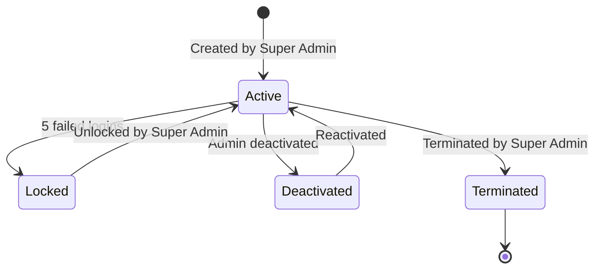

## Creating the Superadmin

The initial superadmin is created using a seeding script:

```bash
pnpm create:admin
```

This runs `tsx scripts/create-admin.ts` and outputs the credentials:

```
═══════════════════════════════════════════════════════
🎉 SUPERADMIN CREATED SUCCESSFULLY!
═══════════════════════════════════════════════════════

📧 Email:     aotf21@gmail.com
👤 Username:  superadmin
🔑 Password:  [Generated Password]

═══════════════════════════════════════════════════════
```

> **⚠️ Important**: Save the generated password immediately. It will not be shown again.

If you run the script again when a superadmin already exists:

```
⚠️  Superadmin already exists:
   Username: superadmin
   Email: aotf21@gmail.com
✨ Seeding skipped - superadmin already exists
```

---

## Creating Additional Admins

Only the **Super Admin** can create new admin accounts via the API:

```
POST /api/v1/admin/admins
```

```json
{
  "username": "support_john",
  "email": "john@example.com",
  "firstName": "John",
  "lastName": "Doe",
  "role": "moderator"
}
```

### What happens:

1. A Clerk user is created with username/password authentication
2. An `Admin` document is created in MongoDB
3. Clerk `publicMetadata` is set with `isAdmin: true`
4. A temporary password is generated and emailed to the new admin
5. On first login, the admin is forced to change their password
6. An audit log entry is created

---

## Admin Account Lifecycle



### Account States

| State | `isActive` | `isLocked` | Can Login? |
|-------|:----------:|:----------:|:----------:|
| **Active** | `true` | `false` | ✅ |
| **Locked** | `true` | `true` | ❌ |
| **Deactivated** | `false` | `false` | ❌ |
| **Terminated** | `false` | - | ❌ (permanent) |

---

## Admin Model

```typescript
{
  clerkId: string,              // Clerk user ID
  username: string,             // Admin username (locked)
  email: string,                // Admin email (locked)
  name: string,                 // Full name
  role: "super_admin" | "admin" | "moderator",
  permissions: { ... },         // Permission flags object
  isActive: boolean,            // Active/deactivated
  isLocked: boolean,            // Locked due to failed attempts
  lockedAt: Date | null,
  failedLoginAttempts: number,
  lastFailedLoginAt: Date | null,
  requirePasswordChange: boolean,
  createdBy: ObjectId | null,   // Admin who created this account
  terminatedBy: ObjectId | null,
  terminatedAt: Date | null,
}
```

### Locked Fields

- **Email** and **username** are locked for admins — they cannot be changed by the admin themselves
- Only the Super Admin can change usernames via the API

---

## Admin Routes

| Route | Purpose |
|-------|---------|
| `/admin/login` | Admin sign-in page |
| `/admin/change-password` | Forced password change page |
| `/admin` | Admin dashboard home |
| `/admin/enquiries` | Enquiry management |
| `/admin/feedbacks` | Feedback management |
| `/admin/tuitions` | Tuition post management |
| `/admin/jobs` | Job post management |
| `/admin/users` | User management |
| `/admin/settings` | Admin management & settings |
| `/admin/invoices` | Invoice management |
| `/admin/payments` | Payment tracking |
| `/admin/ads` | Advertisement management |
| `/admin/reviews` | Review management |
