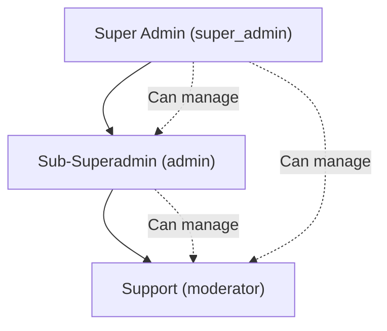

## Overview

AOTF implements a **3-tier Role-Based Access Control (RBAC)** system to manage platform operations. Each admin role has a specific set of permissions that control what actions they can perform.

---

## Admin Roles

### 1. Super Admin (`super_admin`)

The highest authority in the system with **full access** to all features:

- Complete admin management (create, terminate, unlock)
- User management (block, unblock)
- Content management (posts, jobs)
- Financial operations (refunds, invoices)
- Analytics and data export
- Audit log viewing
- System settings

### 2. Sub-Superadmin (`admin`)

A mid-tier role focused on **content management** and **support admin oversight**:

- Manage support admins only (not other sub-superadmins)
- View, edit permissions, and deactivate support admins
- **Cannot** create new admins
- **Cannot** reset passwords
- Full access to content management (posts, jobs)
- All support permissions included
- Can view audit logs

### 3. Support (`moderator`)

An entry-level admin role for **customer-facing operations**:

- Handle customer enquiries and feedback
- Update enquiry status
- Contact applicants and guardians
- **No** access to admin management
- **No** access to user management
- Limited to customer support features

---

## Permission Matrix

| Permission | Super Admin | Sub-Superadmin | Support |
|-----------|:-----------:|:--------------:|:-------:|
| **Content Management** | | | |
| Create Posts (Tuition/Job) | ✅ | ✅ | ❌ |
| Edit Posts | ✅ | ✅ | ❌ |
| Delete Posts | ✅ | ✅ | ❌ |
| **Customer Support** | | | |
| Handle Enquiries | ✅ | ✅ | ✅ |
| Handle Feedback | ✅ | ✅ | ✅ |
| Update Enquiry Status | ✅ | ✅ | ✅ |
| Call Applicants/Guardians | ✅ | ✅ | ✅ |
| **User Management** | | | |
| Manage Users (block/unblock) | ✅ | ❌ | ❌ |
| **Financial** | | | |
| Process Refunds | ✅ | ❌ | ❌ |
| **Analytics** | | | |
| View Analytics | ✅ | ❌ | ❌ |
| Export Data | ✅ | ❌ | ❌ |
| **Admin Management** | | | |
| Create Admins | ✅ | ❌ | ❌ |
| Edit Admins | ✅ | ✅ (support only) | ❌ |
| Deactivate Admins | ✅ | ✅ (support only) | ❌ |
| Terminate Admins | ✅ | ❌ | ❌ |
| Reset Passwords | ✅ | ❌ | ❌ |
| Unlock Accounts | ✅ | ❌ | ❌ |
| View Audit Logs | ✅ | ✅ | ❌ |

---

## Role Hierarchy



**Key rules:**
- Each role includes all permissions of the roles below it
- Sub-Superadmins can only manage support admins, not other sub-superadmins
- Only Super Admins can create new admins or perform destructive operations (terminate, password reset)

---

## Permission Storage

Permissions are stored in the `Admin` model as a structured object:

```typescript
{
  role: "super_admin" | "admin" | "moderator",
  permissions: {
    canManageUsers: boolean,
    canManagePosts: boolean,
    canManageJobs: boolean,
    canHandleEnquiries: boolean,
    canHandleFeedback: boolean,
    canProcessRefunds: boolean,
    canViewAnalytics: boolean,
    canExportData: boolean,
    canManageAdmins: boolean,
    canViewAuditLogs: boolean,
    // ... additional permission flags
  }
}
```

Permissions are checked both in the middleware (route-level access) and in service functions (operation-level access).
