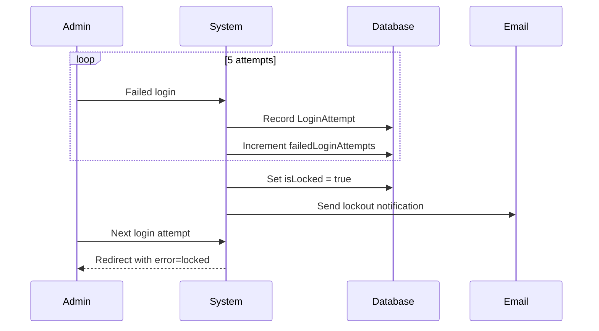

## Failed Login Protection

AOTF implements automatic account locking after repeated failed login attempts.

### How It Works

1. Each failed login attempt is recorded in the `LoginAttempt` collection
2. After **5 failed attempts**, the admin account is automatically **locked**
3. The `isLocked` flag is set to `true` on the `Admin` document
4. An email notification is sent to the admin informing them of the lockout
5. Only the **Super Admin** can unlock the account

### Login Attempt Model

```typescript
{
  clerkId: string,
  email: string,
  username: string,
  success: boolean,
  ipAddress: string,
  userAgent: string,
  failureReason: string | null,
  createdAt: Date,  // Auto-expires after 30 days (TTL index)
}
```

> Login attempt records automatically expire after 30 days to prevent unbounded collection growth.

---

## Forced Password Change

Admins are required to change their password in the following scenarios:

| Trigger | `requirePasswordChange` set to |
|---------|-------------------------------|
| Account creation | `true` |
| Password reset by Super Admin | `true` |
| Account unlock by Super Admin | `true` |

### Enforcement

The middleware checks `requirePasswordChange` on every admin request:

```
if (adminDoc.requirePasswordChange && pathname !== "/admin/change-password") {
  redirect → /admin/change-password
}
```

The admin is locked into the password change page until they set a new password.

---

## Account Lockout

### Automatic Lockout

Triggered when `failedLoginAttempts >= 5`:



### Manual Lockout

The Super Admin can also manually lock an admin account for security purposes via the admin management UI or API.

### Unlocking

```
POST /api/v1/admin/admins/[id]/unlock
```

Only the **Super Admin** can unlock accounts. After unlocking:

1. `isLocked` is set to `false`
2. `failedLoginAttempts` is reset to `0`
3. `requirePasswordChange` is set to `true`
4. Email notification sent to the admin
5. Admin must set a new password on next login

---

## CSRF Protection

All API mutation requests (POST, PATCH, DELETE) are validated against the `Origin` or `Referer` header:

```typescript
function checkCsrfOrigin(request: NextRequest): NextResponse | null {
  const origin = request.headers.get("origin");
  const referer = request.headers.get("referer");
  const host = request.headers.get("host");

  // At least one must be present
  // Must match the application host
}
```

### Allowed Origins

- The current `Host` header value
- `NEXT_PUBLIC_APP_URL` environment variable
- `localhost:3000` and `127.0.0.1:3000` (development only)

---

## Rate Limiting

Sensitive endpoints use an in-memory sliding-window rate limiter:

```typescript
const limiter = createRateLimiter({
  windowMs: 60_000,  // 1 minute window
  max: 5,            // Maximum 5 requests per window
});
```

### Features

- **Sliding window** — Tracks individual request timestamps, not just counts
- **Per-key limiting** — Rate limits are applied per IP address
- **Auto-cleanup** — Stale entries are cleaned up every 5 minutes
- **Standard headers** — Returns `Retry-After` and `X-RateLimit-*` headers

> For multi-instance deployments, replace the in-memory Map with Redis (e.g., `@upstash/ratelimit`).

---

## Content Security Policy

The `next.config.js` sets comprehensive CSP headers:

| Directive | Policy |
|-----------|--------|
| `default-src` | `'self'` |
| `script-src` | `'self'`, Clerk origins, hCaptcha, Razorpay |
| `style-src` | `'self' 'unsafe-inline'` (required by HeroUI) |
| `img-src` | `'self' data: https: blob:` |
| `frame-ancestors` | `'none'` (clickjacking prevention) |

### Additional Security Headers

| Header | Value |
|--------|-------|
| `X-Content-Type-Options` | `nosniff` |
| `X-Frame-Options` | `DENY` |
| `Referrer-Policy` | `strict-origin-when-cross-origin` |
| `Strict-Transport-Security` | `max-age=31536000` (production only) |
| `Permissions-Policy` | Camera self, no microphone/geolocation |

---

## NoSQL Injection Prevention

Mongoose is configured with `sanitizeFilter: true`:

```typescript
mongoose.set("sanitizeFilter", true);
```

This strips MongoDB query operators (`$gt`, `$ne`, `$regex`, etc.) from filter objects, preventing injection attacks through request parameters.
