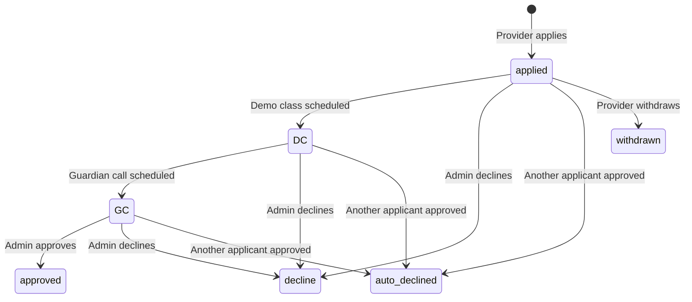

## Overview

Applications are the core of AOTF's matching system. Providers apply to posts (tuitions) or jobs, and admins manage the application through various status stages.

---

## Application Lifecycle



| Status | Code | Description |
|--------|------|-------------|
| Applied | `applied` | Initial state after submitting application |
| Demo Class | `DC` | Demo class scheduled with the student |
| Guardian Call | `GC` | Follow-up call with guardian scheduled |
| Approved | `approved` | Application accepted — teacher assigned |
| Declined | `decline` | Manually declined by admin |
| Auto-Declined | `auto_declined` | Automatically declined when another applicant is approved |
| Withdrawn | `withdrawn` | Provider withdrew their application |

---

## Submit Application

```
POST /api/v1/posts/[postId]/applications
```

or

```
POST /api/v1/jobs/[jobId]/applications
```

Submits a new application. **Authenticated user only.**

**Request Body:**

```json
{
  "coverLetter": "I have 5 years of experience teaching Mathematics..."
}
```

**Validation Rules:**
- User must have completed onboarding
- User cannot apply to the same post/job twice
- Maximum applications per post is configurable (`siteConfig.maxApplicationPerPost`)

---

## List Applications

```
GET /api/v1/posts/[postId]/applications
```

Returns all applications for a specific post. **Admin only.**

---

## Update Application Status

```
PATCH /api/v1/posts/[postId]/applications/[applicationId]
```

Updates an application's status. **Admin only.**

**Request Body (Schedule Demo Class):**

```json
{
  "status": "DC",
  "dcMeta": {
    "scheduledDate": "2026-03-15T10:00:00.000Z"
  }
}
```

**Request Body (Schedule Guardian Call):**

```json
{
  "status": "GC",
  "gcMeta": {
    "scheduledDate": "2026-03-16T14:00:00.000Z"
  }
}
```

**Request Body (Approve):**

```json
{
  "status": "approved"
}
```

> When an application is approved, all other applications for the same post/job are **automatically declined** with `auto_declined` status.

**Request Body (Decline):**

```json
{
  "status": "decline",
  "declineMeta": {
    "reason": "Profile does not match requirements"
  }
}
```

---

## Auto-Decline Behaviour

When an application is approved:

1. All other `applied`, `DC`, and `GC` applications for the same post/job are set to `auto_declined`
2. Each auto-declined application records the ID of the approved application in `declineMeta.autoDeclinedBecauseApplicationId`
3. Calendar events for auto-declined applications are updated
4. The post status changes to `matched`

---

## Application Snapshot

Each application stores a snapshot of the applicant's profile at the time of application:

```json
{
  "applicantSnapshot": {
    "name": "John Doe",
    "email": "john@example.com",
    "phone": "+919876543210",
    "avatarUrl": "https://..."
  }
}
```

This ensures the application data remains consistent even if the user updates their profile later.

---

## Calendar Integration

Application status changes automatically create/update calendar events via Mongoose write-through hooks:

| Event | Calendar Effect |
|-------|----------------|
| New application | Creates calendar event |
| DC scheduled | Updates event with demo class date |
| GC scheduled | Updates event with guardian call date |
| Approved/Declined | Updates event status |
| Deleted | Removes calendar event |

> See [Calendar Integration](/docs/features/calendar-integration) for details.
