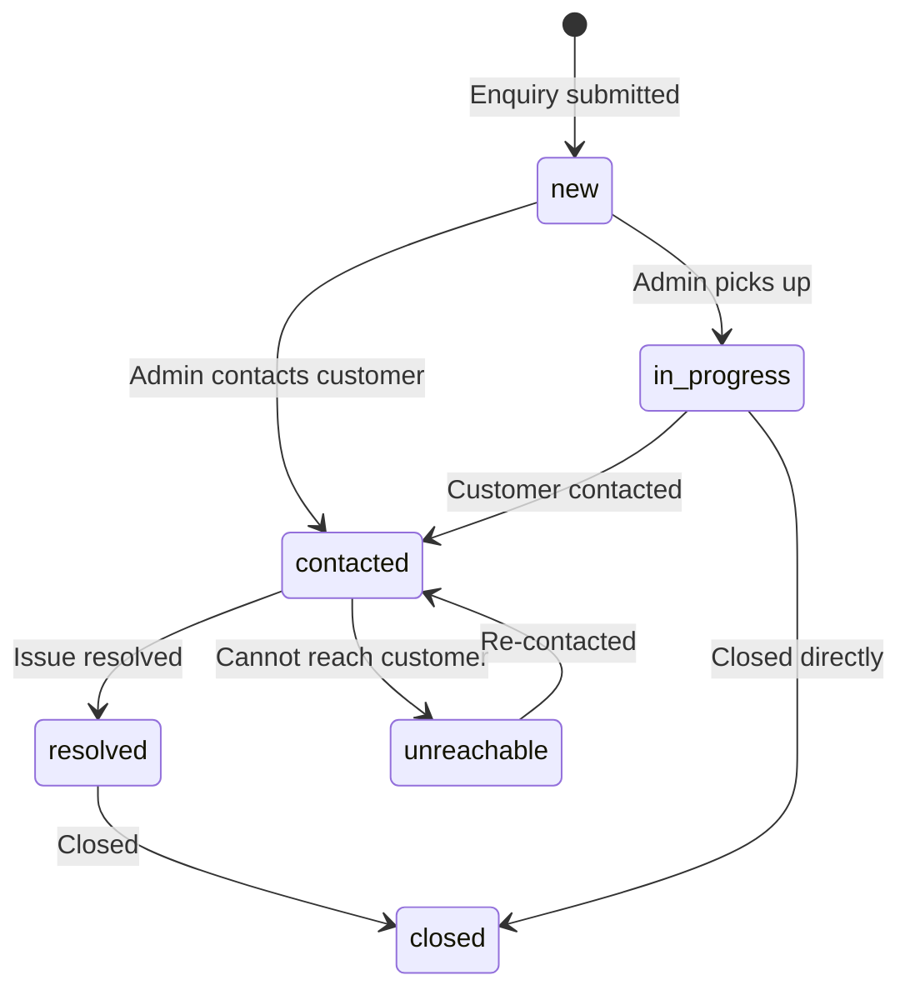

## Base Path

```
/api/v1/enquiry
```

---

## Create Enquiry

```
POST /api/v1/enquiry
```

Submits a new customer enquiry. **Public endpoint** — no authentication required.

**Request Body:**

```json
{
  "name": "John Doe",
  "phoneNumber": "+919876543210",
  "query": "Looking for a Mathematics tutor for Class 10 student in Kolkata"
}
```

| Field | Type | Required | Description |
|-------|------|----------|-------------|
| `name` | `string` | ✅ | Customer name |
| `phoneNumber` | `string` | ✅ | Contact number |
| `query` | `string` | ✅ | Enquiry details |

**Response:** `201 Created`

```json
{
  "success": true,
  "enquiry": {
    "enquiryId": "ENQ-XYZ789",
    "name": "John Doe",
    "currentStatus": "new",
    "createdAt": "2026-03-08T..."
  }
}
```

---

## List Enquiries

```
GET /api/v1/enquiry
```

Returns all enquiries. **Admin only.**

**Query Parameters:**

| Parameter | Type | Description |
|-----------|------|-------------|
| `status` | `string` | Filter by status |
| `page` | `number` | Page number |
| `limit` | `number` | Results per page |

---

## Get Enquiry Details

```
GET /api/v1/enquiry/[enquiryId]
```

Returns detailed information about a specific enquiry. **Admin only.**

---

## Update Enquiry Status

```
PATCH /api/v1/enquiry/[enquiryId]
```

Updates the status and adds action notes. **Admin only.**

**Request Body:**

```json
{
  "currentStatus": "contacted",
  "lastActionNote": "Called customer, they need a tutor for Mathematics"
}
```

---

## Enquiry Status Flow



| Status | Description |
|--------|-------------|
| `new` | Freshly submitted, not yet reviewed |
| `in_progress` | Admin has picked up the enquiry |
| `contacted` | Customer has been contacted |
| `unreachable` | Unable to reach customer |
| `resolved` | Enquiry resolved successfully |
| `closed` | Final state — no further action |

---

## Side Effects

When an enquiry is created or updated, two automatic side effects occur:

1. **Calendar Event** — A calendar event is created/updated for tracking
2. **Google Sheets Sync** — The enquiry is synced to a Google Sheets ledger for offline access

Both are triggered via Mongoose post-hooks and run asynchronously (fire-and-forget).
