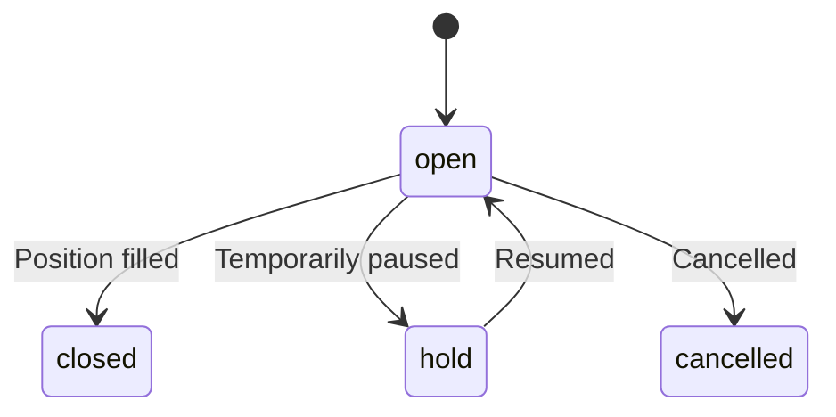

## Base Path

```
/api/v1/jobs
```

---

## List Jobs

```
GET /api/v1/jobs
```

Returns all job/project listings. **Public endpoint.**

**Query Parameters:**

| Parameter | Type | Description |
|-----------|------|-------------|
| `status` | `string` | Filter by status (`open`, `closed`, `hold`, `cancelled`) |
| `workType` | `string` | Filter by type (`job`, `project`) |
| `locationType` | `string` | Filter by location (`remote`, `onsite`, `hybrid`) |
| `page` | `number` | Page number |
| `limit` | `number` | Results per page |

---

## Get Job by ID

```
GET /api/v1/jobs/[jobId]
```

Returns detailed information about a specific job listing.

---

## Create Job

```
POST /api/v1/jobs
```

Creates a new job listing. **Admin only.**

**Request Body:**

```json
{
  "workType": "job",
  "title": "Senior React Developer",
  "clientName": "Tech Corp",
  "phoneNumber": "+919876543210",
  "source": "linkedin",
  "companyType": "company",
  "locationType": "remote",
  "location": "Kolkata, WB",
  "timing": "10 AM - 6 PM IST",
  "experience": "3+ years",
  "gender": "all",
  "salary": "₹50,000/month",
  "requiredQualification": "B.Tech in CS",
  "commissionBasis": "first_month",
  "academyCommissionPercentage": 10
}
```

| Field | Type | Required | Description |
|-------|------|----------|-------------|
| `workType` | `"job" \| "project"` | ✅ | Type of work |
| `title` | `string` | ✅ | Job title |
| `clientName` | `string` | ✅ | Client/company name |
| `phoneNumber` | `string` | ✅ | Client contact |
| `source` | `string` | ✅ | Lead source |
| `companyType` | `"individual" \| "company"` | ✅ | Client type |
| `locationType` | `"remote" \| "onsite" \| "hybrid"` | ✅ | Work location type |
| `location` | `string` | ✅ | Location detail |
| `timing` | `string` | ✅ | Work hours |
| `gender` | `"male" \| "female" \| "both" \| "all"` | ✅ | Gender preference |
| `commissionBasis` | `"first_month" \| "project_value"` | ✅ | Commission calculation basis |
| `academyCommissionPercentage` | `number` | ✅ | AOTF commission percentage |
| `salary` | `string` | ❌ | Salary/compensation |
| `experience` | `string` | ❌ | Required experience |
| `budget` | `string` | ❌ | Project budget (for projects) |
| `duration` | `string` | ❌ | Project duration |
| `brief` | `string` | ❌ | Detailed description |

---

## Update Job

```
PATCH /api/v1/jobs/[jobId]
```

Updates a job listing. **Admin only.**

---

## Job Statuses



| Status | Description |
|--------|-------------|
| `open` | Actively accepting applications |
| `closed` | Position filled or project completed |
| `hold` | Temporarily paused |
| `cancelled` | Permanently cancelled |

---

## Job vs. Project

AOTF supports two work types:

| Type | `commissionBasis` | Typical Fields |
|------|-------------------|---------------|
| **Job** | `first_month` | `salary`, `timing`, `experience` |
| **Project** | `project_value` | `budget`, `duration`, `brief`, `projectType` |
