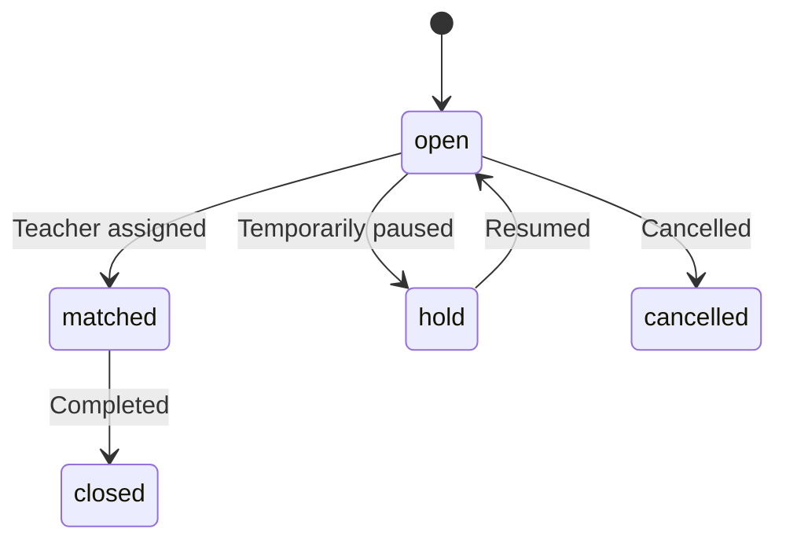

## Base Path

```
/api/v1/posts
```

---

## List Posts

```
GET /api/v1/posts
```

Returns all tuition posts. **Public endpoint** — no authentication required.

**Query Parameters:**

| Parameter | Type | Description |
|-----------|------|-------------|
| `status` | `string` | Filter by status (`open`, `matched`, `closed`, `cancelled`, `hold`) |
| `classType` | `string` | Filter by class type (`online`, `offline`, `both`) |
| `page` | `number` | Page number |
| `limit` | `number` | Results per page |

**Response:** `200 OK`

```json
{
  "success": true,
  "posts": [
    {
      "postId": "POST-ABC123",
      "guardianName": "Parent Name",
      "students": [
        {
          "className": "10th",
          "board": "CBSE",
          "subjects": ["Mathematics", "Physics"]
        }
      ],
      "classType": "offline",
      "frequencyPerWeek": 3,
      "location": "Kolkata, WB",
      "monthlyBudget": 5000,
      "status": "open",
      "createdAt": "2026-03-08T..."
    }
  ]
}
```

---

## Get Post by ID

```
GET /api/v1/posts/[postId]
```

Returns detailed information about a specific tuition post.

---

## Create Post

```
POST /api/v1/posts
```

Creates a new tuition post. **Admin only.**

**Request Body:**

```json
{
  "guardianName": "Parent Name",
  "guardianPhone": "+919876543210",
  "source": "whatsapp",
  "students": [
    {
      "className": "10th",
      "board": "CBSE",
      "subjects": ["Mathematics", "Physics"]
    }
  ],
  "classType": "offline",
  "frequencyPerWeek": 3,
  "preferredDays": ["Monday", "Wednesday", "Friday"],
  "preferredTime": "4:00 PM - 6:00 PM",
  "location": "Belgharia, Kolkata",
  "monthlyBudget": 5000,
  "notes": "Student preparing for board exams"
}
```

| Field | Type | Required | Description |
|-------|------|----------|-------------|
| `guardianName` | `string` | ✅ | Parent/guardian name |
| `guardianPhone` | `string` | ✅ | Contact number |
| `source` | `string` | ✅ | Lead source (whatsapp, website, referral, etc.) |
| `students` | `array` | ✅ | At least one student with class, board, subjects |
| `classType` | `string` | ✅ | `online` / `offline` / `both` |
| `frequencyPerWeek` | `number` | ✅ | Classes per week |
| `location` | `string` | ✅ | Teaching location |
| `monthlyBudget` | `number` | ✅ | Monthly budget in INR |
| `preferredDays` | `string[]` | ❌ | Preferred teaching days |
| `preferredTime` | `string` | ❌ | Preferred time slot |
| `notes` | `string` | ❌ | Additional notes |

---

## Update Post

```
PATCH /api/v1/posts/[postId]
```

Updates a tuition post. **Admin only.**

---

## Update Post Status

```
PATCH /api/v1/posts/[postId]/status
```

Changes the status of a post. **Admin only.**

**Valid Status Transitions:**



---

## Post Data Model

| Field | Type | Description |
|-------|------|-------------|
| `postId` | `string` | Unique identifier (e.g., `POST-ABC123`) |
| `enquiryId` | `ObjectId` | Link to originating enquiry (if any) |
| `guardianName` | `string` | Parent/guardian name |
| `guardianPhone` | `string` | Contact phone |
| `source` | `string` | Lead source |
| `students` | `IStudent[]` | Student details array |
| `classType` | `"online" \| "offline" \| "both"` | Teaching mode |
| `frequencyPerWeek` | `number` | Weekly frequency |
| `location` | `string` | Location |
| `monthlyBudget` | `number` | Budget (INR) |
| `status` | `PostStatus` | Current status |
| `paymentstatus` | `"done" \| "pending"` | Guardian payment status |
| `matchedTeacherClerkId` | `string` | Selected teacher's Clerk ID |
| `invoiceGenerated` | `boolean` | Whether invoice has been created |
