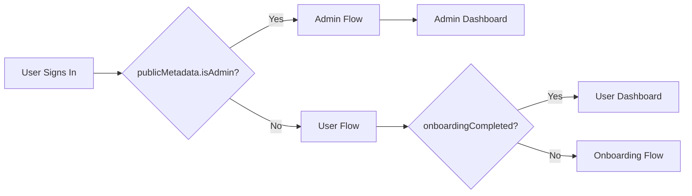
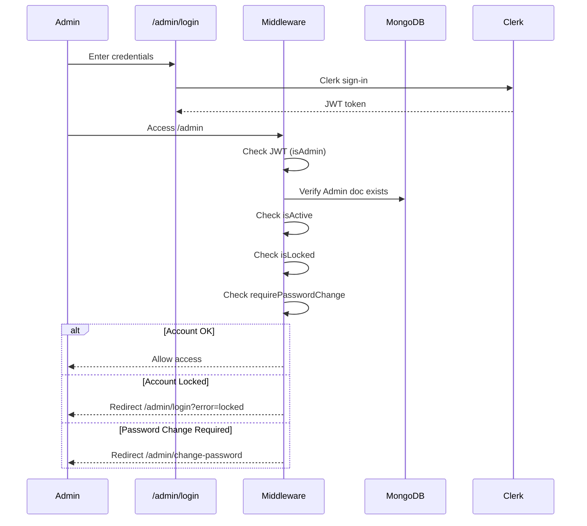

## Overview

AOTF uses **Clerk** for authentication, with a shared instance for both regular users and admin users. Differentiation between the two is done via Clerk's `publicMetadata` field.



---

## Authentication Modes

### Regular Users

- Sign in via `/sign-in` using **username/password** or social providers
- After first sign-in, redirected to `/onboarding` for profile setup and payment
- Session managed via Clerk's JWT tokens
- `publicMetadata.onboardingCompleted` tracks whether onboarding is done

### Admin Users

- Sign in via `/admin/login` using **username/password** only
- Admin accounts are created by the superadmin (not self-registration)
- `publicMetadata.isAdmin = true` distinguishes admins from regular users
- Additional checks: account lock status, forced password change

---

## Session & JWT Claims

Clerk issues JWTs containing `sessionClaims` with the following relevant fields:

```typescript
const { userId, sessionClaims } = await auth();
const meta = sessionClaims?.publicMetadata as Record<string, unknown>;

// Available claims:
meta?.isAdmin           // boolean — is this user an admin?
meta?.onboardingCompleted  // boolean — has onboarding been completed?
```

> **Important**: JWT claims can be stale (Clerk doesn't refresh them immediately after a `publicMetadata` update). The middleware falls back to a database check when the JWT claim is missing or suspect.

---

## Clerk Webhooks

Clerk sends webhook events to `/api/v1/webhooks/clerk` for:

- **User creation** — Creates a matching `User` document in MongoDB
- **User update** — Syncs profile changes
- **User deletion** — Handles cleanup

### Webhook Security

The webhook route is **excluded from Clerk middleware** in `proxy.ts` because `clerkMiddleware` strips the `svix-id`, `svix-timestamp`, and `svix-signature` headers that are needed for webhook verification:

```typescript
// proxy.ts
if (request.nextUrl.pathname.startsWith("/api/v1/webhooks/")) {
  return NextResponse.next({ request: { headers: requestHeaders } });
}
```

---

## Admin Authentication Flow



### Security Layers

1. **Failed Login Protection** — After 5 failed attempts, accounts are locked
2. **Forced Password Change** — New admins and unlocked accounts must change their temporary password
3. **Manual Lock** — Superadmin can manually lock any admin account

---

## Shared Clerk Instance Strategy

Using a single Clerk instance for both users and admins is a deliberate cost-saving decision:

| Approach | Pros | Cons |
|----------|------|------|
| **Shared instance** (current) | Cost-effective, simpler webhook handling | Must differentiate via metadata |
| Separate instances | Clean separation | Double the cost, dual webhook config |

The differentiation logic lives entirely in `proxy.ts` and the `Admin` model, keeping the Clerk configuration simple.
