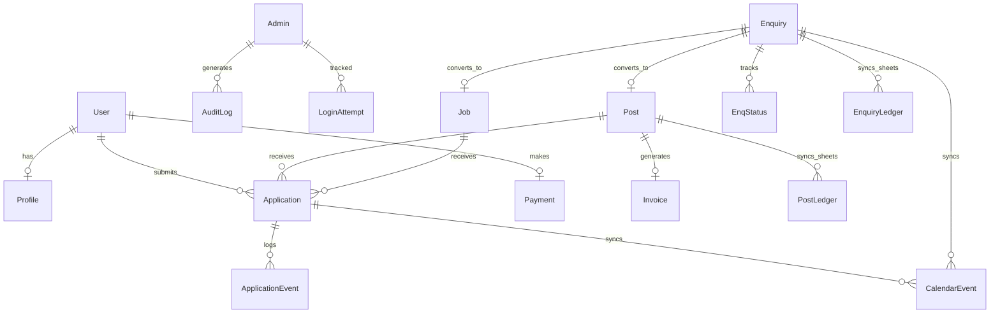

## Overview

AOTF uses **MongoDB Atlas** as its primary database, accessed through **Mongoose** ODM. The database follows a document-oriented design with strategic denormalisation for read performance.

---

## Entity Relationship Diagram



---

## Collections

### Core Identity

| Collection | Model | Description |
|-----------|-------|-------------|
| `users` | `User` | User accounts (clerkId, username, role, plan, onboarding status) |
| `profiles` | `Profile` | Extended user profiles (education, skills, experience) |
| `admins` | `Admin` | Admin accounts with RBAC permissions |

### Gig Management

| Collection | Model | Description |
|-----------|-------|-------------|
| `posts` | `Post` | Tuition requirements (guardian info, students, subjects, budget) |
| `jobs` | `Job` | Job/project listings (title, client, salary, location type) |
| `applications` | `Application` | Provider applications to posts/jobs |
| `applicationevents` | `ApplicationEvent` | Application state change history |

### Customer Support

| Collection | Model | Description |
|-----------|-------|-------------|
| `enquires` | `Enquiry` | Customer enquiry tickets |
| `enqstatuses` | `EnqStatus` | Enquiry status change log |
| `feedbacks` | `Feedback` | Customer feedback entries |

### Finance

| Collection | Model | Description |
|-----------|-------|-------------|
| `invoices` | `Invoice` | Generated invoices with line items and versioning |
| `payments` | `Payment` | Payment records (Razorpay) |

### System

| Collection | Model | Description |
|-----------|-------|-------------|
| `auditlogs` | `AuditLog` | Admin action audit trail |
| `loginattempts` | `LoginAttempt` | Login attempt history (auto-expires after 30 days) |
| `calendarevents` | `CalendarEvent` | Calendar events for scheduling |
| `todoevents` | `TodoEvent` | Admin todo/task items |
| `webhookevents` | `WebhookEvent` | Clerk webhook event log |

### Content

| Collection | Model | Description |
|-----------|-------|-------------|
| `ads` | `Ad` | Advertisement placements |
| `renownedteachers` | `RenownedTeacher` | Featured teacher profiles |
| `reviews` | `Review` | User reviews/testimonials |
| `subjects` | `Subject` | Subject catalogue |
| `sources` | `Source` | Lead source tracking |

---

## Connection Management

The database connection is managed through `lib/db.ts` with the following features:

### Connection Pooling

```typescript
const CONNECT_OPTIONS = {
  maxPoolSize: 10,
  serverSelectionTimeoutMS: 15_000,
  connectTimeoutMS: 15_000,
  socketTimeoutMS: 30_000,
  heartbeatFrequencyMS: 10_000,
};
```

### Global Cache

A global cache prevents multiple connections during Next.js hot reloads:

```typescript
const globalWithMongoose = globalThis as typeof globalThis & {
  mongoose?: MongooseCache;
};
```

### Retry with Backoff

Failed connections are retried up to **3 times** with exponential backoff (2s → 4s → 8s), handling Atlas M0 cold starts gracefully.

### Connection Health Check

Before reusing a cached connection, `readyState` is verified. If the connection has dropped, it's automatically cleared and reconnected.

---

## Security Measures

| Measure | Implementation |
|---------|---------------|
| **NoSQL Injection Prevention** | `mongoose.set('sanitizeFilter', true)` strips `$gt`, `$ne`, etc. from filters |
| **Schema Validation** | Mongoose schemas enforce types, enums, and required fields |
| **Index Safety** | Unique indexes with partial filter expressions prevent duplicates |
| **TTL Indexes** | `LoginAttempt` documents auto-expire after 30 days |

---

## Write-Through Hooks

Several models use Mongoose post-hooks for automatic side effects:

| Model | Hook | Side Effect |
|-------|------|-------------|
| `Application` | `post('save')` | Upsert calendar event |
| `Application` | `post('findOneAndUpdate')` | Update calendar event |
| `Application` | `post('findOneAndDelete')` | Delete calendar event |
| `Enquiry` | `post('save')` | Upsert calendar event + Google Sheets sync |
| `Enquiry` | `post('findOneAndUpdate')` | Update calendar event + Google Sheets sync |

> These hooks are fire-and-forget (`void`) to avoid blocking the primary operation.
