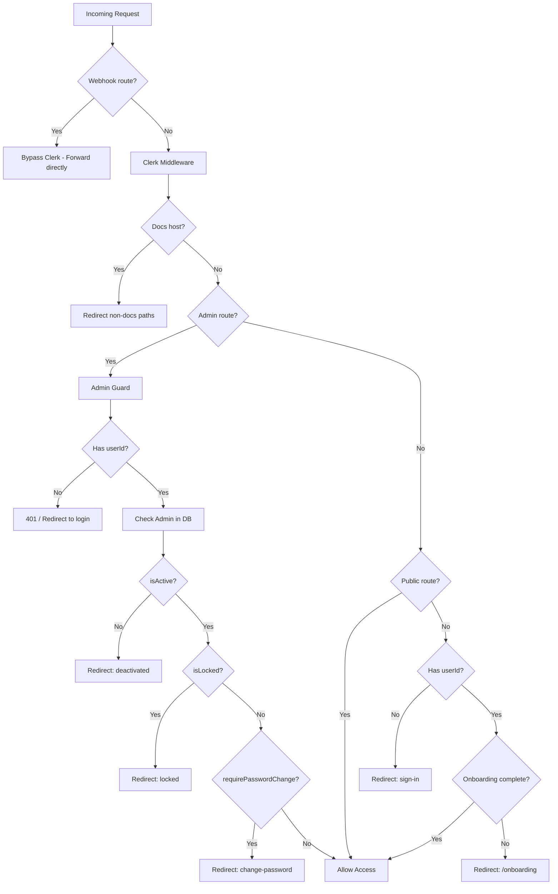

## Overview

AOTF's middleware (`proxy.ts`) is the central gateway for all requests. It wraps Clerk's middleware with additional logic for admin access control, onboarding enforcement, and request logging.

---

## Route Classification

The middleware classifies every incoming request into one of these categories:

### Public Routes

Open to all visitors, no authentication required:

```
/                           # Homepage
/sign-in, /sign-up          # Auth pages
/admin/login, /admin/join   # Admin auth
/about, /contact, /terms    # Static pages
/jobs, /posts, /enquiry     # Public listings
/docs                       # Documentation
/api/v1/posts               # Public API
/api/v1/jobs                # Public API
/api/v1/webhooks            # Clerk webhooks
```

### Protected Admin Routes

Require authentication + admin role:

```
/admin/*                    # Admin UI pages
/api/v1/admin/*             # Admin API endpoints
/api/admin/*                # Admin API endpoints
```

### Protected User Routes

Require authentication + completed onboarding:

```
/u/[username]/*             # User dashboard
/api/v1/profile             # Profile management
/api/v1/payments            # Payment management
```

---

## Middleware Pipeline



---

## Key Middleware Features

### 1. Admin Role Verification

The middleware uses a **two-tier check** — JWT claim first, database fallback:

```typescript
// Fast path: check JWT metadata
let isAdminConfirmed = meta?.isAdmin === true;

// Slow path: verify against DB (source of truth)
const adminDoc = await Admin.findOne(
  { clerkId: userId },
  { isActive: 1, isLocked: 1, requirePasswordChange: 1 }
).lean();

if (adminDoc) isAdminConfirmed = true;
```

This handles the case where Clerk's JWT hasn't yet propagated a `publicMetadata` update.

### 2. Onboarding Gate

Non-admin users who haven't completed onboarding are redirected:

- **Page requests** → Redirect to `/onboarding`
- **API requests** → Return `403` with `{ error: "Onboarding required" }`

The gate checks JWT first, then falls back to a database query for the `onboardingCompleted` field.

### 3. Admin Onboarding Skip

Admins bypass the onboarding check entirely. If an admin hits `/onboarding` or `/api/v1/onboarding`, the middleware short-circuits with a success response.

### 4. Dashboard Redirect

The `/dashboard/redirect` route resolves the user's username from the database and redirects to `/u/[username]/dashboard`.

### 5. Docs Subdomain Support

When accessed via `docs.aotf.in`, non-docs paths are redirected to `/docs`:

```typescript
const isDocsHost = host === "docs.aotf.in" || host === "www.docs.aotf.in";
if (isDocsHost && !pathname.startsWith("/docs")) {
  return NextResponse.redirect(new URL("/docs", req.url));
}
```

---

## Request Headers

The middleware sets a custom header on every request:

```typescript
requestHeaders.set("x-aotf-pathname", pathname);
```

This allows downstream route handlers to access the original pathname.

---

## API Request Logging

All API requests are logged with method, path, and duration:

```
[POST] /api/v1/posts — 45ms
[GET] /api/v1/jobs — 12ms
```

---

## Matcher Configuration

The middleware runs on all routes **except** static assets:

```typescript
export const config = {
  matcher: ["/((?!_next/static|_next/image|favicon.ico|.*\\..*).*)" ],
};
```
