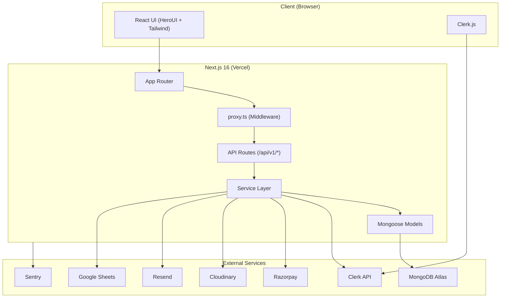
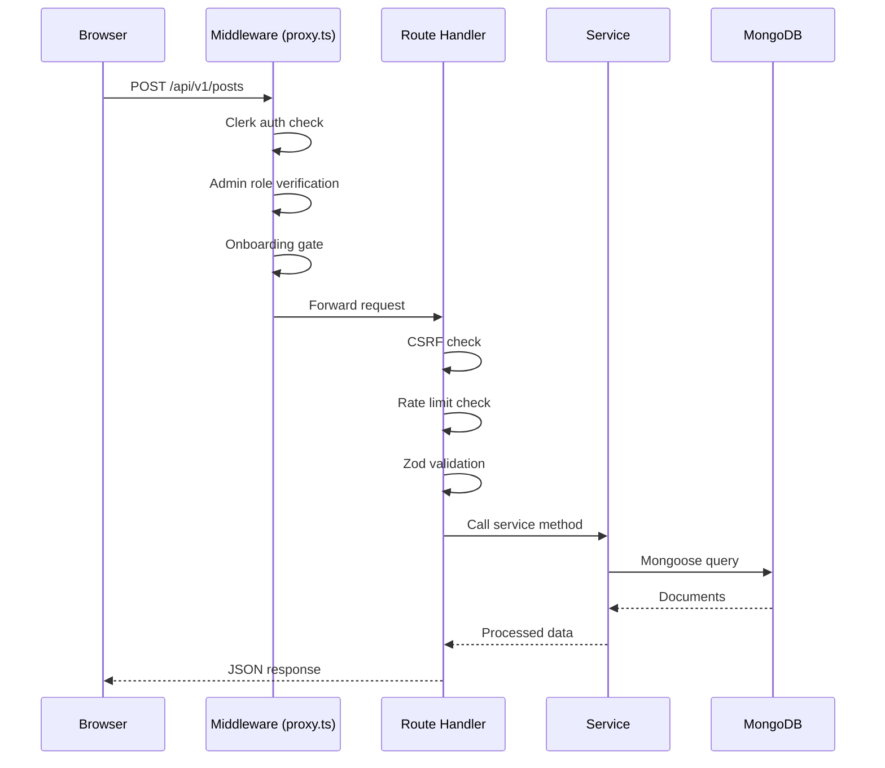

## Architecture Diagram



---

## Design Principles

### 1. Monolithic Fullstack

AOTF is a **single Next.js application** that serves both the frontend UI and backend API. This simplifies deployment (one Vercel project) and allows shared TypeScript types between client and server.

### 2. Layered Architecture

The codebase follows a clear separation of concerns:

```
Request → Middleware → Route Handler → Service → Model → Database
```

| Layer | Location | Responsibility |
|-------|----------|---------------|
| **Middleware** | `proxy.ts` | Auth, RBAC, onboarding gates |
| **Route Handlers** | `app/api/v1/*/route.ts` | HTTP parsing, validation, response |
| **Services** | `lib/services/*.ts` | Business logic, data transformation |
| **Models** | `lib/models/*.ts` | Schema definition, indexes, hooks |
| **Database** | `lib/db.ts` | Connection management, retry logic |

### 3. Convention over Configuration

- API routes use a consistent pattern: validate → authenticate → call service → return response
- All errors flow through `handleApiError()` for uniform error responses
- Models use Mongoose hooks for side effects (calendar sync, Google Sheets)

### 4. Security First

Multiple security layers are applied:

- **CSRF protection** on all mutations via origin checking
- **Rate limiting** on sensitive endpoints
- **NoSQL injection prevention** via Mongoose's `sanitizeFilter`
- **Content Security Policy** headers for XSS mitigation
- **HSTS** in production for forced HTTPS

---

## Request Lifecycle

A typical authenticated API request flows through:



---

## Deployment Architecture

AOTF is deployed on **Vercel** with the following setup:

- **Serverless Functions** — Each API route runs as an isolated serverless function
- **Edge Middleware** — `proxy.ts` runs at the edge for fast auth checks
- **Static Generation** — Marketing pages and docs are statically generated at build time
- **MongoDB Connection Pooling** — Shared connection pool across function invocations with `maxPoolSize: 10`
- **Sentry Tunnel** — Client errors routed through `/monitoring` to bypass ad blockers
