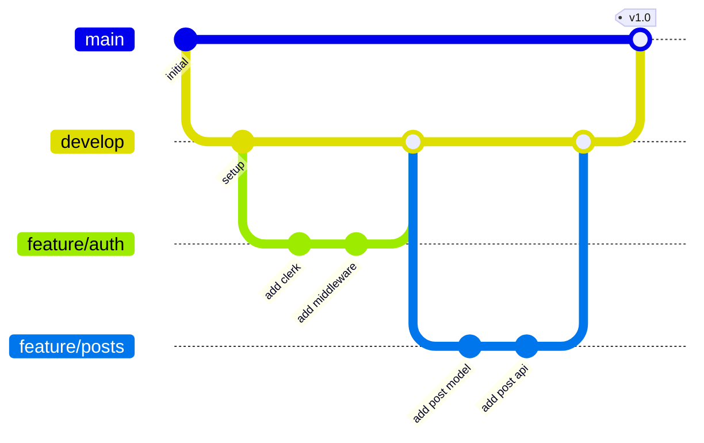

## Getting Started as a Contributor

1. Clone the repository (see [Installation](/docs/getting-started/installation))
2. Set up your environment (see [Environment Variables](/docs/getting-started/environment-variables))
3. Run the dev server (see [Running Locally](/docs/getting-started/running-locally))
4. Familiarise yourself with the [Code Conventions](/docs/contributing/code-conventions)

---

## Branch Strategy

| Branch | Purpose |
|--------|---------|
| `main` | Production-ready code, deployed to Vercel |
| `develop` | Integration branch for features |
| `feature/*` | Individual feature branches |
| `fix/*` | Bug fix branches |
| `hotfix/*` | Emergency production fixes |

### Workflow



---

## Making Changes

### 1. Create a Branch

```bash
git checkout -b feature/your-feature-name
```

### 2. Make Your Changes

Follow the [Code Conventions](/docs/contributing/code-conventions) and established patterns.

### 3. Test Your Changes

```bash
# Run linting
pnpm lint

# Run tests (if applicable)
pnpm test

# Test the build
pnpm build
```

### 4. Commit

Write clear, descriptive commit messages:

```
feat: add application auto-decline on approval
fix: handle MongoDB connection timeout in middleware
docs: update API reference for posts endpoint
chore: update Clerk SDK to v6.39
```

### 5. Push & Create PR

```bash
git push origin feature/your-feature-name
```

Create a Pull Request with:
- Description of changes
- Screenshots (for UI changes)
- Testing steps
- Related issues

---

## Testing

### Unit Tests

The project uses **Jest** for unit testing:

```bash
pnpm test
```

Jest config (`jest.config.ts`):
- Uses `ts-jest` for TypeScript support
- `jest-environment-node` for server-side tests
- Tests are co-located in `__tests__` directories

### Service Tests

Service layer tests verify business logic in isolation:

```
lib/services/__tests__/
```

### Manual Testing

For UI changes, manually test:
- All responsive breakpoints (mobile, tablet, desktop)
- Dark mode and light mode
- Different user roles (unauthenticated, user, admin)

---

## Adding a New Feature

### 1. Model (if needed)

Create the Mongoose model in `lib/models/`:
- Define the schema with proper types and validation
- Add indexes for query patterns
- Export the model with hot-reload safety

### 2. Service

Create the service in `lib/services/`:
- Encapsulate all business logic
- Always call `dbConnect()` first
- Throw `AppError` subclasses for errors

### 3. Validation

Create Zod schemas in `lib/validations/`:
- Validate all API inputs
- Provide clear error messages

### 4. API Route

Create the route handler in `app/api/v1/`:
- Follow the standard pattern (CSRF → Rate limit → Validate → Service → Response)
- Use `handleApiError()` in catch blocks

### 5. UI Components

Create components in `components/`:
- Use HeroUI components where possible
- Follow existing patterns for data fetching
- Add loading states and error handling

### 6. Documentation

Update the docs in `content/docs/`:
- Add API endpoint documentation
- Document any new models
- Update relevant feature guides

---

## Adding Documentation Pages

To add a new documentation page:

1. Create an `.mdx` file in the appropriate `content/docs/` subdirectory
2. Add frontmatter with `title` and `description`
3. Add the page to the section's `meta.json` for sidebar ordering
4. Use relative links for cross-page navigation: `[link text](./other-page)`

```mdx
---
title: My New Page
description: What this page covers.
---

## Content

Your documentation content here.
```
