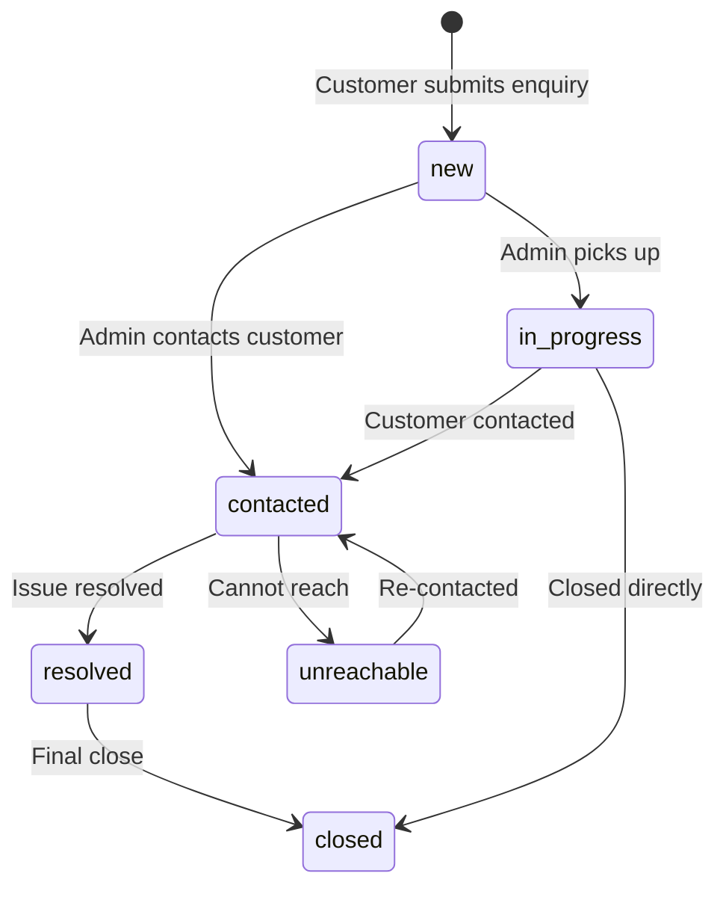

## Overview

The `Enquiry` model represents a customer enquiry — an initial contact from someone interested in AOTF's services. Enquiries can later be converted into Posts (tuitions) or Jobs.

**Collection:** `enquires`
**File:** `lib/models/Enquiry.ts`

---

## Schema

| Field | Type | Required | Default | Description |
|-------|------|:--------:|---------|-------------|
| `enquiryId` | `String` | ✅ | — | Unique identifier (e.g., `ENQ-XYZ789`) |
| `name` | `String` | ✅ | — | Customer name |
| `phoneNumber` | `String` | ✅ | — | Contact number |
| `query` | `String` | ✅ | — | Enquiry details |
| `currentStatus` | `String` | ✅ | `"new"` | Current status |
| `firstResponseAt` | `Date` | — | — | When admin first responded |
| `resolvedAt` | `Date` | — | — | When enquiry was resolved |
| `lastActionNote` | `String` | — | — | Most recent action note |
| `lastActionByAdminId` | `ObjectId` | — | — | Admin who last acted |
| `lastActionAt` | `Date` | — | — | When last action occurred |

---

## Status Flow



| Status | Description |
|--------|-------------|
| `new` | Fresh enquiry, not yet reviewed |
| `in_progress` | Admin has started working on it |
| `contacted` | Customer has been contacted |
| `unreachable` | Unable to reach the customer |
| `resolved` | Enquiry resolved successfully |
| `closed` | Final state — no further action needed |

---

## Indexes

| Name | Fields | Purpose |
|------|--------|---------|
| `enquiry_ix_1` | `enquiryId: 1` | Unique lookup |
| `enquiry_ix_2` | `currentStatus: 1, createdAt: -1` | Status-filtered listing |
| `enquiry_ix_3` | `phoneNumber: 1` | Find by phone |
| `enquiry_ix_4` | `phoneNumber: 1, currentStatus: 1` | Compound phone+status |

---

## Automated Side Effects

The Enquiry model triggers two automatic side effects via Mongoose post-hooks:

### 1. Calendar Event Sync

```typescript
EnquirySchema.post("save", function(doc) {
  void upsertCalendarEvent(mapEnquiry(doc.toObject()));
});
```

Creates/updates a calendar event for the enquiry, allowing admins to track follow-ups.

### 2. Google Sheets Sync

```typescript
EnquirySchema.post("save", function(doc) {
  void import("@/lib/services/enquiryLedger.service").then(
    ({ upsertEnquiryLedger }) =>
      upsertEnquiryLedger(doc.enquiryId)
  );
});
```

Syncs the enquiry to a Google Sheets ledger for offline tracking and reporting. Uses dynamic import to avoid loading the Google Sheets SDK unnecessarily.

Both hooks are fire-and-forget (`void`) and run on `save` and `findOneAndUpdate`.

---

## Enquiry Status Model

The `EnqStatus` model (`lib/models/EnqStatus.ts`) tracks individual status changes:

```typescript
{
  enquiryId: string,
  status: string,
  note: string,
  changedByAdminId: ObjectId,
  createdAt: Date,
}
```

---

## Conversion to Posts/Jobs

When an enquiry results in a concrete requirement, it can be converted:

- **To a Tuition Post** — `Post.enquiryId` links back to the enquiry
- **To a Job Listing** — `Job.enquiryId` links back to the enquiry

This allows tracking the full lifecycle from initial enquiry to active listing.
