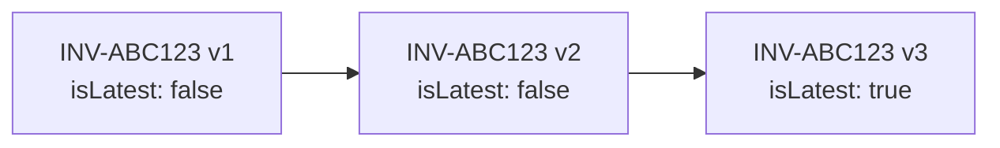

## Overview

The `Invoice` model represents a generated invoice for tuition services. It supports versioning, partial payments, line items with tax calculations, and assigned teacher tracking.

**Collection:** `invoices`
**File:** `lib/models/Invoice.ts`

---

## Schema

| Field | Type | Required | Default | Description |
|-------|------|:--------:|---------|-------------|
| `invoiceId` | `String` | ✅ | — | Human-readable ID (e.g., `INV-ABC123`) |
| `version` | `Number` | ✅ | `1` | Invoice version (1-indexed) |
| `isLatest` | `Boolean` | ✅ | `true` | Only the latest version is `true` |
| `source` | `ContactInfo` | ✅ | — | AOTF (sender) details |
| `recipient` | `ContactInfo` | ✅ | — | Client/guardian details |
| `serviceProvider` | `ServiceProvider` | ✅ | — | AOTF business details |
| `amount` | `AmountSummary` | ✅ | — | Financial summary |
| `breakdown` | `Breakdown` | ✅ | — | Line items + notes |
| `paymentStatus` | `String` | ✅ | `"unpaid"` | Payment status |
| `partialPayment` | `PartialPayment` | — | — | Partial payment details |
| `paymentDate` | `Date` | — | — | When payment was received |
| `invoiceDate` | `Date` | ✅ | — | Invoice creation date |
| `dueDate` | `Date` | — | — | Payment due date |
| `assignedTeacher` | `AssignedTeacher` | — | — | Teacher snapshot |
| `postId` | `String` | — | — | Linked tuition post |
| `projectId` | `String` | — | — | Linked project (future) |
| `revisionReason` | `String` | — | — | Why this revision was made |
| `revisedByAdminId` | `ObjectId` | — | — | Admin who revised |

---

## Sub-documents

### Contact Info

Used for both `source` and `recipient`:

```typescript
{
  name: string,
  address?: string,
  phone?: string,
  email?: string,
}
```

### Service Provider

Extended contact info for AOTF:

```typescript
{
  name: string,
  address?: string,
  phone?: string,
  email?: string,
  websiteUrl?: string,
  signatureUrl?: string,
}
```

### Line Item

```typescript
{
  name: string,
  description?: string,
  quantity: number,      // Min: 0
  unitAmount: number,    // Min: 0
  total: number,         // Min: 0
  postDetails?: {
    postId?: string,
    preferredTime?: string,
    preferredDays?: string[],
    location?: string,
    classType?: string,
    frequencyPerWeek?: number,
  },
}
```

### Amount Summary

```typescript
{
  currency: string,        // Default: "INR"
  subTotal: number,
  taxPercentage: number,   // Default: 0
  taxAmount: number,       // Default: 0
  grandTotal: number,
}
```

### Partial Payment

```typescript
{
  amountPaid: number,       // Amount already paid
  percentagePaid: number,   // 0-100
  amountDue: number,        // Amount still outstanding
}
```

### Assigned Teacher

```typescript
{
  name: string,
  phone?: string,
}
```

---

## Versioning

Invoices support versioning for revisions:

1. When an invoice is revised, a new document is created with `version + 1`
2. The old version's `isLatest` is set to `false`
3. The new version's `isLatest` is set to `true`
4. `revisionReason` documents why the revision was made



---

## Payment Status

| Status | Description |
|--------|-------------|
| `paid` | Full payment received |
| `unpaid` | No payment received |
| `partial` | Partial payment — `partialPayment` object is populated |

---

## Indexes

| Fields | Purpose |
|--------|---------|
| `invoiceId: 1` | Unique lookup |
| `paymentStatus: 1` | Filter by payment status |
| `postId: 1` | Find invoice for a tuition post |
| `projectId: 1` | Find invoice for a project |
| `createdAt: -1` | Chronological listing |
| `isLatest: 1, createdAt: -1` | Latest versions only |
