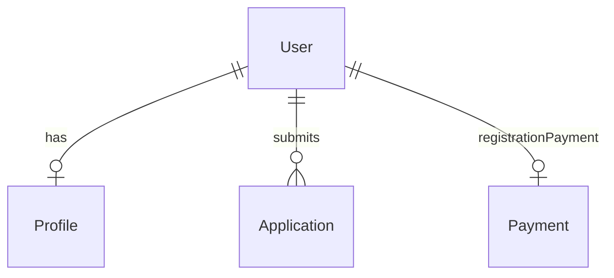

## Overview

The `User` model represents a registered user account. It's linked to Clerk via `clerkId` and serves as the primary identity in the system.

**Collection:** `users`
**File:** `lib/models/User.ts`

---

## Schema

| Field | Type | Required | Default | Description |
|-------|------|:--------:|---------|-------------|
| `clerkId` | `String` | ✅ | — | Clerk user ID (unique, indexed) |
| `username` | `String` | ✅ | — | Lowercase, trimmed username |
| `role` | `String` | ✅ | `"teacher"` | User role |
| `plan` | `Plan` | — | `{}` | Subscription plan details |
| `onboardingCompleted` | `Boolean` | — | `false` | Whether onboarding is done |
| `status` | `String` | — | `"active"` | Account status (indexed) |
| `registrationPaymentId` | `ObjectId` | — | `null` | Reference to Payment document |
| `deletionWarningEmailSentAt` | `Date` | — | `null` | When 5-day warning email was sent |
| `createdAt` | `Date` | auto | — | Mongoose timestamp |
| `updatedAt` | `Date` | auto | — | Mongoose timestamp |

### Role Enum

```typescript
"teacher" | "teacher_candidate" | "admin"
```

### Status Enum

```typescript
"active" | "blocked" | "deleted"
```

---

## Plan Sub-document

| Field | Type | Default | Description |
|-------|------|---------|-------------|
| `current` | `String` | `"teacher"` | Current plan (`"teacher"` or `"teacher_candidate"`) |
| `hasTuitionAccess` | `Boolean` | `false` | Can apply to tuition posts |
| `hasCandidateAccess` | `Boolean` | `false` | Can apply to job listings |
| `activatedAt` | `Date` | `null` | When plan was activated |

---

## Indexes

| Index | Fields | Options |
|-------|--------|---------|
| Primary | `clerkId: 1` | `unique: true` |
| Username | `username: 1` | `unique: true, collation: { locale: "en_US", strength: 2 }` |
| Status | `status: 1` | — |

> The username index uses case-insensitive collation, so `"JohnDoe"` and `"johndoe"` are treated as the same username.

---

## Profile Model

The `Profile` model extends user identity with detailed information:

**Collection:** `profiles`
**File:** `lib/models/Profile.ts`

The profile stores education details, skills, experience, and contact information that providers display on their public profile page (`/u/[username]`).

---

## Relationships



| Relation | Type | Description |
|----------|------|-------------|
| `User → Profile` | One-to-One | Extended profile information |
| `User → Application` | One-to-Many | Applications submitted by user |
| `User → Payment` | One-to-One | Registration payment record |
