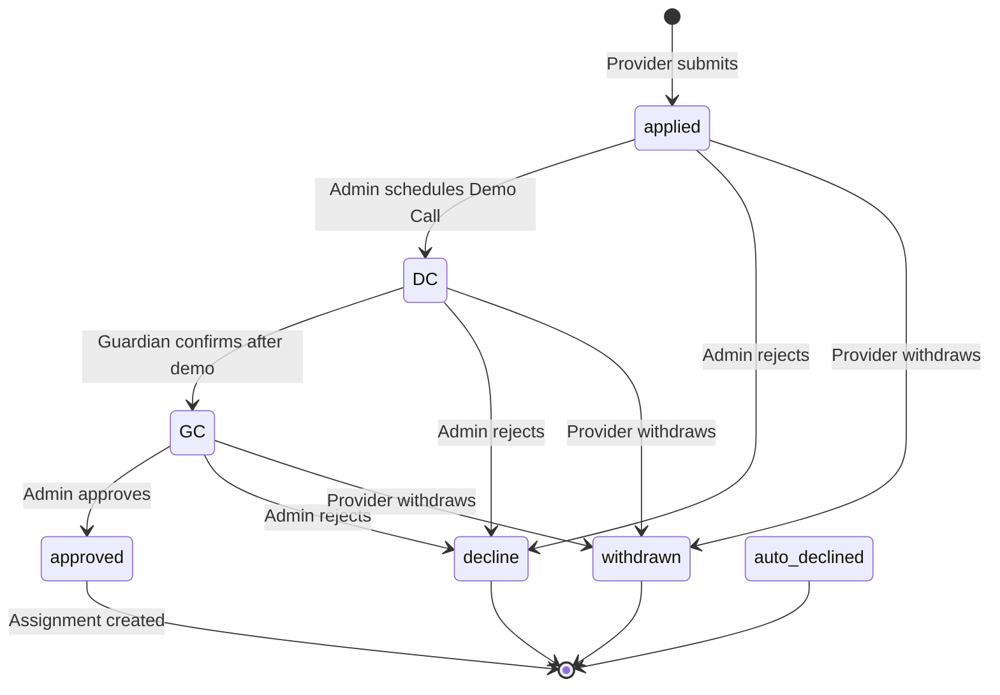

# Application Lifecycle

Understanding the application lifecycle is critical for anyone working on or with the AOTF admin panel.

## Status State Machine



## Status Meanings

| Status | Who Triggers | Meaning | Can Reverse? |
|---|---|---|---|
| `applied` | Provider | Initial submission | Via withdrawal |
| `DC` | Admin | Demo Call scheduled with provider | Admin can update dcDate |
| `GC` | Admin | Consumer confirmed after demo | Admin can revert to DC |
| `approved` | Admin | Provider selected, assignment created | **No** — triggers auto-decline |
| `decline` | Admin | Provider rejected | No |
| `auto_declined` | System | Automatically declined when another was approved | No |
| `withdrawn` | Provider | Provider withdrew their application | No |

## The Approval Cascade

When an admin sets an application to `approved`, the system automatically:

1. Sets the approved application status to `approved`
2. Finds **all other applications** for the same post/job that are **not** `withdrawn` or `declined`
3. Sets all of them to `auto_declined` in a single MongoDB `updateMany` operation
4. Updates `Post.status` or `Job.status` to `matched`
5. Updates the `PostLedger` with teacher assignment details
6. Creates an `ApplicationEvent` for each status change
7. Sends notifications to affected providers

```ts
// Simplified auto-decline logic (in the approve API handler)
await Application.updateMany(
  {
    $or: [{ postId }, { jobId }],
    _id: { $ne: approvedApplicationId },
    status: { $nin: ["withdrawn", "decline", "auto_declined"] },
  },
  {
    $set: {
      status: "auto_declined",
      declinedAt: new Date(),
    },
  }
);
```

**Why atomic?** This prevents the "two providers think they're approved" race condition.

## Demo Call (DC) Flow

The DC stage involves scheduling a trial session between the provider and consumer:

1. Admin calls the provider → discusses the requirement
2. Admin schedules a demo call date (`dcDate`)
3. `PATCH /api/v1/applications/:id` with `{ status: "DC", dcDate: "2026-01-15T15:00:00Z" }`
4. A `CalendarEvent` is created for the demo date
5. Admin reminds the provider via notification

## Guardian Confirmation (GC) Flow

After the demo:

1. Admin calls the consumer/guardian to get feedback
2. If consumer wants to proceed: `PATCH` with `{ status: "GC" }`
3. If consumer declines: `PATCH` with `{ status: "decline", declineReason: "Consumer preferred someone else" }`

## Provider Withdrawal

Providers can withdraw at any stage before `approved`:

```http
PATCH /api/v1/applications/:id
Authorization: Bearer <provider_jwt>
{ "status": "withdrawn" }
```

Withdrawn applications count toward the provider's history but don't affect their reputation score (no review triggers).

## ApplicationEvent Audit Trail

Every status change (including auto-declines) is logged in `ApplicationEvent`:

```json
[
  { "fromStatus": null, "toStatus": "applied", "changedByClerkId": "user_provider" },
  { "fromStatus": "applied", "toStatus": "DC", "changedByClerkId": "user_admin", "metadata": { "dcDate": "..." } },
  { "fromStatus": "DC", "toStatus": "GC", "changedByClerkId": "user_admin" },
  { "fromStatus": "GC", "toStatus": "approved", "changedByClerkId": "user_admin" }
]
```

Admins can view this history in the application detail view.

## Provider Notifications

Providers receive email notifications at each stage:

| Status Change | Email |
|---|---|
| `applied` | "Application received" confirmation |
| `DC` | "Demo scheduled for [date]" |
| `decline` | "Application update" with feedback reason |
| `auto_declined` | "Application update — another provider was selected" |
| `approved` | "Congratulations — you've been selected!" |
