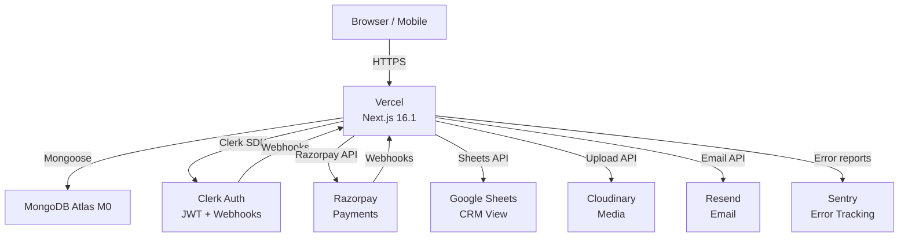
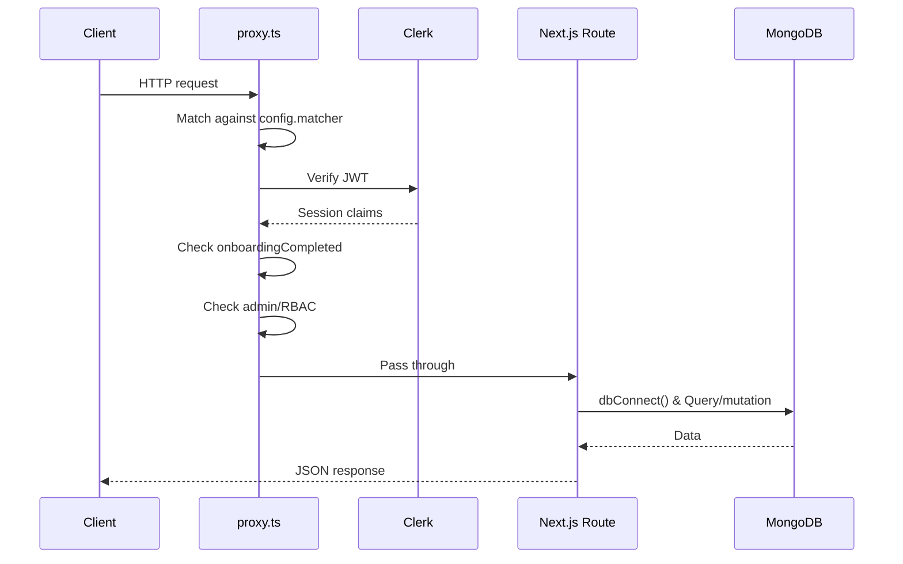

# System Architecture

## High-Level Architecture



## Request Lifecycle



## Directory Structure

```
aotf_v2/
├── app/
│   ├── (auth)/                # Clerk sign-in/sign-up pages
│   │   ├── sign-in/
│   │   └── sign-up/
│   ├── (marketing)/           # Public landing pages
│   │   ├── page.tsx           # Homepage
│   │   └── about/
│   ├── admin/                 # Admin panel (protected)
│   │   ├── layout.tsx         # Admin layout + sidebar
│   │   ├── dashboard/
│   │   ├── posts/
│   │   ├── jobs/
│   │   ├── applications/
│   │   ├── enquiries/
│   │   ├── calendar/
│   │   ├── analytics/
│   │   └── settings/
│   ├── api/
│   │   ├── health/            # GET /api/health
│   │   ├── openapi.json/      # GET /api/openapi.json
│   │   ├── search/            # GET /api/search (Fumadocs)
│   │   └── v1/
│   │       ├── admin/         # Admin management APIs
│   │       ├── applications/
│   │       ├── enquiry/
│   │       ├── jobs/
│   │       ├── me/
│   │       ├── onboarding/
│   │       ├── payments/
│   │       ├── posts/
│   │       ├── profile/
│   │       ├── users/
│   │       └── webhooks/
│   │           ├── clerk/
│   │           └── razorpay/
│   ├── docs/                  # Fumadocs documentation
│   │   ├── layout.tsx
│   │   └── [[...slug]]/
│   ├── jobs/                  # Public job listings
│   ├── onboarding/            # Provider onboarding flow
│   ├── posts/                 # Public tuition listings
│   └── u/                     # Provider profile pages
│       └── [username]/
│           ├── page.tsx       # Public profile
│           ├── dashboard/
│           └── applications/
├── components/
│   ├── aceternity/            # Aceternity UI components
│   ├── admin/                 # Admin panel components
│   ├── docs/                  # Documentation components
│   ├── mdx/                   # MDX element renderers
│   ├── providers/             # Context providers
│   ├── shared/                # Cross-context components
│   └── ui/                    # Base UI components
├── content/docs/              # MDX documentation pages
├── lib/
│   ├── models/                # Mongoose schemas
│   │   ├── admin/             # Admin-specific models
│   │   ├── Application.ts
│   │   ├── CalendarEvent.ts
│   │   ├── Enquiry.ts
│   │   ├── Invoice.ts
│   │   ├── Job.ts
│   │   ├── Post.ts
│   │   ├── PostLedger.ts
│   │   ├── Profile.ts
│   │   ├── TodoEvent.ts
│   │   └── User.ts
│   ├── services/              # Business logic services
│   │   ├── calendar-event.service.ts
│   │   ├── enquiryLedger.service.ts
│   │   └── postLedger.service.ts
│   ├── api-utils.ts           # CSRF, rate limit, error handler
│   ├── db.ts                  # MongoDB connection singleton
│   ├── googleSheets.ts        # Sheets client + tab management
│   ├── rate-limit.ts          # In-memory sliding window limiter
│   ├── source.ts              # Fumadocs content source
│   └── validations/           # Zod schemas (shared client/server)
├── proxy.ts                   # Next.js proxy (Clerk auth + routing)
├── scripts/                   # CLI scripts (admin, seeding, benchmarks)
├── styles/                    # Global CSS + docs theme
├── source.config.ts           # Fumadocs MDX config
├── next.config.ts             # Next.js config + security headers
└── instrumentation.ts         # Server startup warm-up
```

## Services Layer (`lib/services/`)

| Service | File | Purpose |
|---|---|---|
| Calendar Events | `calendar-event.service.ts` | `upsertCalendarEvent`, `deleteCalendarEvent`, mapping functions for each source type |
| Enquiry Ledger | `enquiryLedger.service.ts` | `upsertEnquiryLedger` — writes to MongoDB + Google Sheets |
| PostLedger | `postLedger.service.ts` | `upsertPostLedger` — writes to MongoDB + Google Sheets |

All services are called **asynchronously** from Mongoose hooks — they never block API responses.

## Key Design Decisions

| Decision | Rationale |
|---|---|
| Next.js App Router | Server Components reduce client JS bundle; co-location of UI + API |
| Mongoose over Prisma | MongoDB Atlas M0 doesn't support Prisma's transactions fully |
| Clerk for auth | Handles auth complexity (JWT, sessions, webhooks) out of the box |
| In-memory rate limiter | Simple and zero-dependency for current single-server deployment |
| Mongoose hooks for Sheets sync | Decouples sync from API logic; sync failures don't affect API |
| `proxy.ts` over `middleware.ts` | Next.js 16+ requirement (see [proxy vs middleware](/docs/explanations/proxy-vs-middleware)) |
