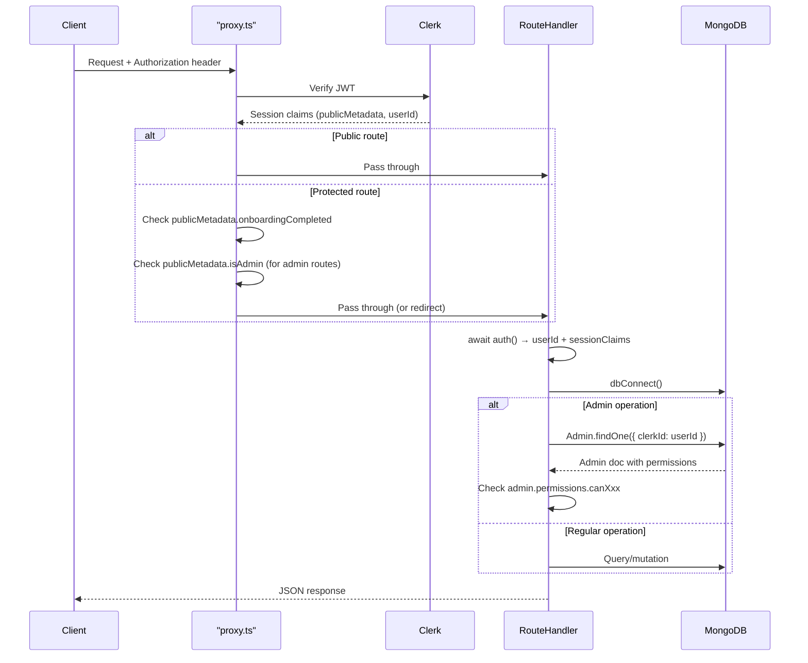
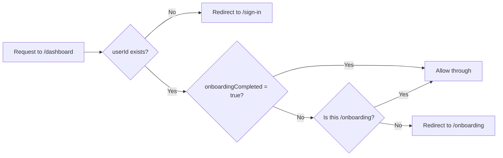

# Auth & Session Flow

AOTF uses a **two-tier auth check**: JWT claims first (fast, no DB call), then DB verification for admin/sensitive operations.

## Complete Auth Flow



## The JWT Claims

Clerk embeds `publicMetadata` directly in the JWT token body. This means every request carries this data **without any extra API call**:

```ts
// What sessionClaims.publicMetadata looks like for a provider:
{
  role: "teacher",
  onboardingCompleted: true
}

// For an admin:
{
  isAdmin: true,
  role: "super_admin",
  aotfRole: "SUPER_ADMIN",
  permissions: { canManagePosts: true, canViewAnalytics: true, ... },
  requirePasswordChange: false
}
```

## Fast Path vs Slow Path

### Fast Path (proxy.ts / JWT only)

For route access decisions, the proxy reads from JWT claims — no DB call:

```ts
// proxy.ts
const meta = sessionClaims?.publicMetadata as AdminMetadata;

// This check costs 0 DB queries
if (!meta?.onboardingCompleted) {
  return NextResponse.redirect(new URL("/onboarding", req.url));
}
```

### Slow Path (route handler / DB)

For permission enforcement on admin operations, the DB is always checked:

```ts
// In an admin API route handler
const admin = await Admin.findOne({ clerkId: userId }).lean();

if (!admin?.isActive) {
  return NextResponse.json({ error: "Account inactive" }, { status: 403 });
}

if (!admin.permissions.canManagePosts) {
  return NextResponse.json({ error: "Insufficient permissions" }, { status: 403 });
}
```

**Why check DB even though JWT has permissions?**

1. **Stale JWT**: Permissions in the JWT are from when the token was last issued. If an admin's permissions are revoked, the JWT won't reflect this until it expires and is refreshed (up to 7 days).
2. **Security principle**: Financial operations, user blocking, and admin management must always use the authoritative source.
3. **Account state**: `isActive` and `isLocked` are not in the JWT — they require a DB lookup.

## Session Token Refresh

JWT tokens are valid for 7 days by default. When Clerk `publicMetadata` is updated (e.g., after onboarding), the client must re-fetch the session to get a fresh JWT:

```ts
// Client-side — force session refresh after onboarding complete
const { reload } = useAuth();
await reload({ force: true });
// Now sessionClaims.publicMetadata.onboardingCompleted === true
```

## The onboardingCompleted Gate

The proxy enforces onboarding completion before any authenticated access:



`onboardingCompleted` is set to `true` by:

- **`POST /api/v1/payments/verify`** — after Razorpay payment (new sign-ups)
- **`POST /api/v1/payments/activate-legacy`** — after migrated users click **Activate Account** on `/onboarding`

For legacy migrated users, the `user.created` webhook sets `onboardingCompleted: false` and preserves migration flags (`migratedFromLegacy`, `registrationFeeStatus`, `legacyPlan`, `legacyTeacherId`). Activation happens only when the user completes the in-app flow.

## Edge Runtime Limitation

`proxy.ts` runs on the Edge Runtime (Vercel edge network). The Edge Runtime does **not** have access to:

- Node.js `net`, `fs`, `crypto` modules (partially available)
- Direct MongoDB connections

This is why **all DB operations happen in Route Handlers** (Node.js runtime), never in the proxy. The proxy only reads JWT claims — which are embedded in the token and don't require any external call.
