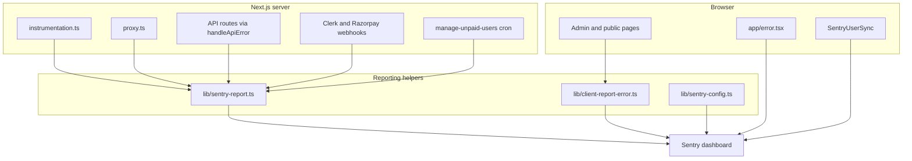

# Monitoring with Sentry

> **If you can't measure, you can't improve.**

AOTF runs on free-tier infrastructure (Vercel serverless + MongoDB Atlas M0) and integrates with many external services — Clerk, Razorpay, Google Sheets, Cloudinary, and Resend. Failures can happen anywhere in that stack: a webhook signature mismatch, a cold-start timeout, an admin form fetch that throws. Without centralized error visibility, those failures stay invisible until a user complains.

Sentry gives the team a single place to see what broke, how often, and for whom — so fixes can be prioritized by impact instead of guesswork.

## Why Sentry Was Added

| Goal | How Sentry helps |
|---|---|
| Catch unexpected 500s | API routes, webhooks, cron jobs, and the admin UI all report unhandled errors |
| Attribute errors to context | Tags like `route`, `layer`, and `feature` narrow down where to look |
| Monitor scheduled jobs | The `manage-unpaid-users` cron sends check-ins and reports failures |
| Fix faster | Source-mapped stack traces point to exact file:line; session replay shows what the user did before a client error |

For step-by-step incident response, see [Triage Sentry Errors](/docs/how-to/triage-sentry-errors).

## What You Get (Outputs)

Sentry org: **`aotf`** · project: **`javascript-nextjs`** · dashboard: [aotf.sentry.io](https://aotf.sentry.io/)

| Sentry surface | What you see | AOTF examples |
|---|---|---|
| **Issues** | Grouped exceptions with stack traces | API 500, webhook processing failure, admin page fetch error |
| **Performance / Traces** | Slow transactions (sampled) | Slow DB queries or API handlers |
| **Session Replay** | User session around a client error (sampled) | Admin form submit failure |
| **Crons** | Missed or failed scheduled jobs | `manage-unpaid-users` daily check-ins |
| **Users** | Clerk user id attached to events | Set by `SentryUserSync` in `app/providers.tsx` |

### Sampling vs errors

**All unhandled exceptions are captured** — sampling only applies to performance traces and session replay:

| Signal | Development | Production |
|---|---|---|
| Errors | 100% | 100% |
| Traces | 100% | 10% |
| Session replay | 100% | 10% |

This keeps observability costs manageable on the free tier while still measuring every real failure.

## How Errors Flow Through the App

## Configuration Map

| Concern | Env var / setting | Config file |
|---|---|---|
| DSN (runtime) | `NEXT_PUBLIC_SENTRY_DSN` | `lib/sentry-config.ts` |
| Server SDK init | — | `sentry.server.config.ts` |
| Edge SDK init | — | `sentry.edge.config.ts` |
| Client SDK init | — | `instrumentation-client.ts` |
| Request-level errors | `onRequestError` hook | `instrumentation.ts` |
| Build + source maps | `SENTRY_AUTH_TOKEN`, `SENTRY_ORG`, `SENTRY_PROJECT` | `next.config.js` (`withSentryConfig`) |
| Ad-blocker tunnel | `tunnelRoute: "/monitoring"` | `next.config.js` |
| Sampling rates | `NODE_ENV` | `lib/sentry-config.ts` |
| PII | `sendDefaultPii: false` in prod | `lib/sentry-config.ts` |

`NEXT_PUBLIC_SENTRY_DSN` is the only runtime variable required for error reporting. The `SENTRY_*` build variables are optional but recommended — they upload source maps during CI/Vercel builds so stack traces map to TypeScript source instead of minified bundles.

A fallback DSN exists in `lib/sentry-config.ts` for local development. Production should always set `NEXT_PUBLIC_SENTRY_DSN` explicitly in Vercel. Do not commit real DSN values to documentation or version control.

See the [Environment Variables reference](/docs/reference/env-vars#sentry-monitoring) for the full variable list.

## Coverage Layers

Reporting is **pattern-based** across the codebase — not a per-file inventory.

### Framework

- `instrumentation.ts` — `onRequestError` captures unhandled Next.js request errors; MongoDB warm-up failures call `reportError`
- `app/error.tsx` — root error boundary calls `Sentry.captureException`
- `app/admin/(calendar)/error.tsx` — admin calendar error boundary

### Server

- `handleApiError()` in `lib/api-utils.ts` — catch-all 500 path calls `reportError(error, { route: context })`
- Direct `reportError()` in routes that need custom context (webhooks, proxy, cron)
- `proxy.ts` — auth/routing failures in four catch blocks

### Client

- `reportClientError()` in admin pages and shared components (forms, dashboards, cards)
- Skips HTTP 4xx responses and operational errors via `shouldReportToSentry()`

### Cron monitoring

The daily unpaid-user job at `GET /api/v1/cron/manage-unpaid-users` reports check-ins to Sentry Crons:

- Monitor slug: `manage-unpaid-users`
- Schedule: `30 21 * * *` (21:30 UTC daily)
- Uses `Sentry.captureCheckIn` for in-progress, success, and error states

## What Is Intentionally Not Reported

`shouldReportToSentry()` in `lib/sentry-report.ts` filters out expected operational noise:

| Error type | Why it is skipped |
|---|---|
| Zod validation errors | User input mistakes → 400 response, not a bug |
| `AppError` with status &lt; 500 | Operational errors (not found, forbidden, etc.) |
| Mongoose duplicate key (`11000`) | Handled as 409 Conflict |
| Malformed JSON (`SyntaxError`) | Handled as 400 Bad Request |
| `"Payment cancelled"` | User closed the Razorpay modal |
| `AbortError` | User navigated away or cancelled a fetch |

If a new category of expected error starts flooding Sentry, extend `shouldReportToSentry()` in code — do not silence issues in the Sentry dashboard alone.

## Ad-Blocker Tunnel

Browser error reports are routed through a Next.js rewrite at `/monitoring` (configured in `next.config.js` via `tunnelRoute`). This prevents ad-blockers from blocking requests to `*.sentry.io` ingest endpoints. Server-side errors are unaffected — they call Sentry directly.

## Privacy

- Production sets `sendDefaultPii: false` — Sentry does not collect IP addresses, cookies, or request bodies by default
- `SentryUserSync` attaches only the Clerk user `id` to events, not email or name

## Related Docs

- [Environment Variables — Sentry](/docs/reference/env-vars#sentry-monitoring)
- [Deploy to Vercel — Sentry checklist](/docs/how-to/deploy-vercel#sentry-post-deploy-checklist)
- [Triage Sentry Errors](/docs/how-to/triage-sentry-errors)
- [API Overview — Error Handling](/docs/reference/api/overview#error-handling)
