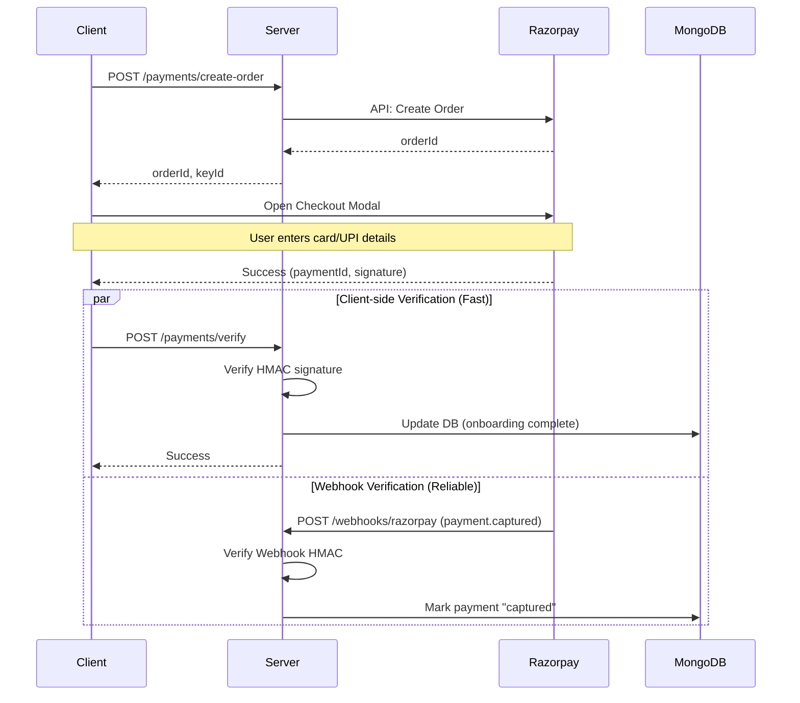

# Payment Architecture

AOTF processes provider registration fees (one-time) through **Razorpay**. The architecture ensures that payments are never lost, even if the user closes their browser or loses network connection during the payment modal.

## Dual-Verification Flow

The system uses a **redundant, dual-verification design**:

### 1. The Fast Path (Client Verification)

When the Razorpay modal closes successfully, the `handler` callback immediately POSTs the `razorpay_signature` to `/api/v1/payments/verify`.
- **Pros**: Immediate UX feedback. The user is instantly redirected to the dashboard.
- **Cons**: If the user closes the tab immediately after payment, or the network drops, this request never fires.

### 2. The Reliable Path (Webhook)

Razorpay guarantees delivery of webhook events from their servers directly to AOTF's server.
- **Pros**: Unaffected by client network issues or closed browsers.
- **Cons**: Can be delayed by a few seconds or minutes depending on Razorpay's queue.

## Idempotent Updates

Because both paths try to perform the same actions (mark payment complete, set `onboardingCompleted: true`), the DB updates must be idempotent.

In both the verify handler and the webhook, we use `findOneAndUpdate` or explicit state checks to ensure we don't accidentally grant access twice or trigger dual side-effects.

## Fee Structure Math

AOTF charges providers a registration fee. The business logic deducts Razorpay's processing fees to calculate the net amount received.

| Component | Calculation |
|---|---|
| Razorpay Processing Fee | 2% of transaction amount |
| GST (Goods and Services Tax) | 18% of the Processing Fee |
| **Total Deduction** | `Amount * 0.02 * 1.18` (Effective 2.36%) |

This math is important for accounting and is handled in the `Payment` tracking.

## Refunds

Admins with the `canProcessRefunds` permission can initiate full or partial refunds via the admin panel.

1. Admin initiates refund
2. Server calls Razorpay Refund API
3. `AuditLog` entry created (`refund_initiated`)
4. Razorpay webhook `refund.processed` updates the `Payment` document status to `refunded`.
