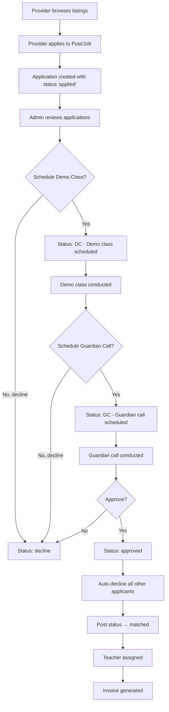

## Overview

The application lifecycle is the core matching engine of AOTF. It tracks a provider's journey from initial application through review stages to final approval or decline.

---

## Complete Lifecycle



---

## Status Transitions

| From | To | Trigger | Actor |
|------|-----|---------|-------|
| — | `applied` | Provider submits application | User |
| `applied` | `DC` | Admin schedules demo class | Admin |
| `applied` | `decline` | Admin rejects | Admin |
| `applied` | `withdrawn` | Provider withdraws | User |
| `DC` | `GC` | Admin schedules guardian call | Admin |
| `DC` | `decline` | Admin rejects after demo | Admin |
| `GC` | `approved` | Admin approves | Admin |
| `GC` | `decline` | Admin rejects after call | Admin |
| Any active | `auto_declined` | Another applicant approved | System |

---

## Application Constraints

### Per-Post Limits

Each post/job has a maximum number of applications, configured in `config/site.ts`:

```typescript
maxApplicationPerPost: 3 // Default, can be changed
```

### Duplicate Prevention

Unique compound indexes prevent a user from applying twice to the same gig:

- `{ jobId: 1, applicantId: 1 }` — One application per job per user
- `{ postId: 1, applicantId: 1, applicantType: 1 }` — One application per post per user per type

---

## Auto-Decline Mechanism

When an application is **approved**, all other active applications for the same post/job are automatically declined:

1. All `applied`, `DC`, and `GC` status applications are set to `auto_declined`
2. Each auto-declined application records:
   - `declineMeta.autoDeclinedBecauseApplicationId` — ID of the approved application
   - `declineMeta.declinedAt` — Timestamp
3. Calendar events are updated for all affected applications
4. The parent post/job status changes to `matched`

---

## Post-Approval Actions

After an application is approved:

1. **Post status** changes to `matched`
2. **Teacher assigned** — `matchedTeacherClerkId` is set on the post
3. **Calendar events** updated for all applications
4. **Email notifications** sent to approved and declined applicants
5. **Invoice** can be generated linking the post to the assigned teacher

---

## Applicant Types

| Type | Applies To | Plan Required |
|------|-----------|---------------|
| `teacher` | Tuition Posts | `hasTuitionAccess: true` |
| `candidate` | Job Listings | `hasCandidateAccess: true` |

---

## Snapshot Strategy

When a user applies, their current profile is **snapshotted** into the application:

```typescript
applicantSnapshot: {
  name: "John Doe",
  email: "john@example.com",
  phone: "+919876543210",
  avatarUrl: "https://..."
}
```

This ensures that even if the user updates their profile later, the application retains the state at the time of submission.
