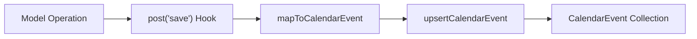

## Overview

AOTF maintains a calendar system that automatically tracks key events (applications, enquiries, demo classes, guardian calls) without manual data entry. This is achieved through Mongoose **write-through hooks** that fire after database operations.

---

## How It Works



When a model document is created, updated, or deleted, a Mongoose post-hook automatically:

1. **Maps** the document to a calendar event input
2. **Upserts** the calendar event (create or update based on a unique key)
3. **Deletes** the calendar event if the source document is removed

---

## Event Sources

### Applications

| Application Status | Calendar Event |
|-------------------|----------------|
| `applied` | Event created with application date |
| `DC` | Event updated with demo class scheduled date |
| `GC` | Event updated with guardian call scheduled date |
| `approved` / `decline` | Event updated with final status |
| Deleted | Calendar event removed |

**Event Key Format:**
- Tuition applications: `application:{id}:tuition`
- Job applications: `application:{id}:job`

### Enquiries

| Enquiry Action | Calendar Event |
|---------------|----------------|
| Created | Event created with enquiry date |
| Status updated | Event updated with new status |
| Deleted | Calendar event removed |

**Event Key Format:** `enquiry:{id}`

---

## Calendar Event Model

**Collection:** `calendarevents`
**File:** `lib/models/CalendarEvent.ts`

The CalendarEvent model stores scheduled events with rich metadata:

```typescript
{
  eventKey: string,       // Unique key (e.g., "application:123:tuition")
  title: string,          // Event title
  description: string,    // Event details
  startDate: Date,        // Event start
  endDate: Date,          // Event end
  category: string,       // Event category
  status: string,         // Event status
  metadata: object,       // Source-specific data
  createdAt: Date,
  updatedAt: Date,
}
```

---

## Service Functions

The calendar event service (`lib/services/calendar-event.service.ts`) provides:

### `upsertCalendarEvent(input)`

Creates or updates a calendar event based on the `eventKey`:

```typescript
await upsertCalendarEvent({
  eventKey: "application:abc123:tuition",
  title: "Demo Class - John Doe",
  startDate: new Date("2026-03-15T10:00:00Z"),
  category: "demo_class",
  // ...
});
```

### `deleteCalendarEvent(eventKey)`

Removes a calendar event:

```typescript
await deleteCalendarEvent("application:abc123:tuition");
```

### `mapApplication(doc)`

Maps an Application document to a calendar event input:

```typescript
const input = mapApplication(applicationDoc.toObject());
if (input) void upsertCalendarEvent(input);
```

### `mapEnquiry(doc)`

Maps an Enquiry document to a calendar event input.

---

## Hook Registration

Hooks are registered on the Mongoose schema, ensuring they fire automatically:

```typescript
// Application model
ApplicationSchema.post("save", function(doc) { ... });
ApplicationSchema.post("findOneAndUpdate", function(doc) { ... });
ApplicationSchema.post("findOneAndDelete", function(doc) { ... });

// Enquiry model
EnquirySchema.post("save", function(doc) { ... });
EnquirySchema.post("findOneAndUpdate", function(doc) { ... });
EnquirySchema.post("findOneAndDelete", function(doc) { ... });
```

### Important Notes

- Hooks are **fire-and-forget** (`void`) — they don't block the primary operation
- `updateMany` is intentionally excluded — it doesn't provide individual updated documents
- For bulk auto-decline operations, calendar sync is handled explicitly in the service layer
- Hooks fire on `save`, `findOneAndUpdate`, and `findOneAndDelete` (but not `updateMany` or `deleteMany`)

---

## Todo Events

In addition to calendar events, the `TodoEvent` model (`lib/models/TodoEvent.ts`) provides a task management system for admins to create and track action items.
