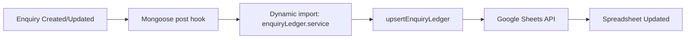

## Overview

AOTF syncs enquiry data to a **Google Sheets** ledger for offline tracking and reporting. This allows the team to view and manage enquiry data in a familiar spreadsheet format without needing to access the admin dashboard.

---

## How It Works



### Trigger Points

The sync fires automatically via Mongoose post-hooks on the `Enquiry` model:

```typescript
// On create
EnquirySchema.post("save", function(doc) {
  void import("@/lib/services/enquiryLedger.service").then(
    ({ upsertEnquiryLedger }) =>
      upsertEnquiryLedger(doc.enquiryId)
  );
});

// On update
EnquirySchema.post("findOneAndUpdate", function(doc) {
  // ... same pattern
});
```

> The Google Sheets SDK is loaded via **dynamic import** to avoid loading it unnecessarily for operations that don't touch enquiries.

---

## Configuration

### Google Service Account

1. Create a Google Cloud project
2. Enable the Google Sheets API
3. Create a service account and download the JSON key
4. Share the target spreadsheet with the service account email

### Environment Variables

```bash
# Path to service account credentials
GOOGLE_APPLICATION_CREDENTIALS=./aotf-service-account.json

# Target spreadsheet ID
GOOGLE_SHEET_ID=1BxiMVs0XRA5nFMdKvBdBZjgmUUqptlbs74OgVE2upms
```

---

## Service Functions

### `upsertEnquiryLedger(enquiryId)`

Syncs a single enquiry to the Google Sheets ledger:

```typescript
import { upsertEnquiryLedger } from "@/lib/services/enquiryLedger.service";

await upsertEnquiryLedger("ENQ-XYZ789");
```

The function:
1. Fetches the enquiry from MongoDB
2. Checks if a row exists for this `enquiryId` in the spreadsheet
3. If exists → updates the row
4. If not → appends a new row

### Ledger Columns

The spreadsheet typically includes:

| Column | Description |
|--------|-------------|
| Enquiry ID | Unique identifier |
| Name | Customer name |
| Phone | Contact number |
| Query | Enquiry details |
| Status | Current status |
| Created At | Submission date |
| Last Action | Most recent action note |
| Last Action By | Admin who last acted |

---

## Post Ledger

Similarly, the `PostLedger` model and `postLedger.service.ts` provide Google Sheets sync for tuition posts, allowing admins to track post data (guardian details, teacher assignments, payment status) in a spreadsheet.

---

## Error Handling

Sheets sync failures are caught and logged without blocking the primary operation:

```typescript
upsertEnquiryLedger(doc.enquiryId).catch((err) =>
  console.error("[Enquiry hook] Sheet sync failed:", err)
);
```

### Common Issues

| Issue | Solution |
|-------|----------|
| Auth failure | Verify service account key file exists and is valid |
| Permission denied | Share the spreadsheet with the service account email |
| Rate limit | Google Sheets API allows ~100 requests/100 seconds per user |
| Missing env var | Set `GOOGLE_SHEET_ID` and `GOOGLE_APPLICATION_CREDENTIALS` |

---

## Google Sheets Helper

The `lib/googleSheets.ts` module provides the low-level Google Sheets API wrapper:

```typescript
import { google } from "googleapis";

const auth = new google.auth.GoogleAuth({
  keyFile: process.env.GOOGLE_APPLICATION_CREDENTIALS,
  scopes: ["https://www.googleapis.com/auth/spreadsheets"],
});

const sheets = google.sheets({ version: "v4", auth });
```
