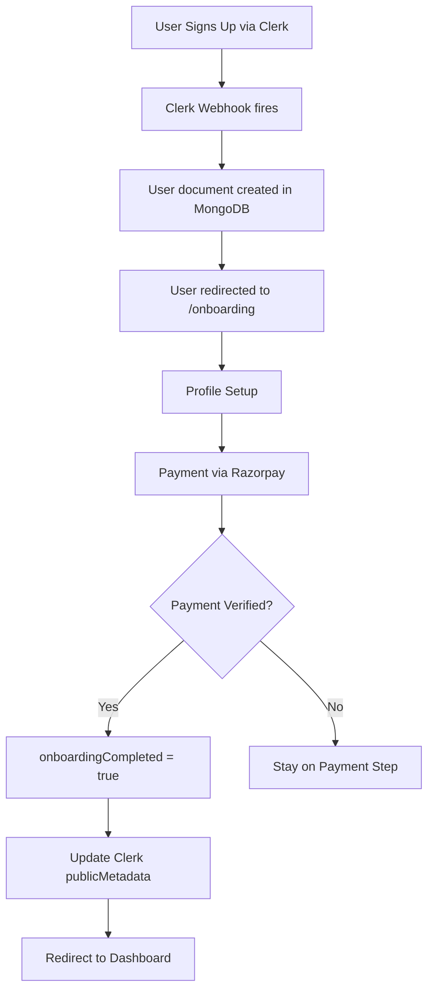

## Overview

AOTF uses a gated onboarding flow to ensure every active user has a complete profile and has paid their registration fee. The onboarding gate is enforced at the middleware level.

---

## Flow Diagram



---

## Middleware Enforcement

The `proxy.ts` middleware enforces onboarding for all authenticated, non-admin users:

```typescript
// Skip if:
// - Public route
// - Admin user
// - Already on /onboarding
// - Onboarding API route

if (meta?.onboardingCompleted !== true) {
  // Check DB as fallback (JWT may be stale)
  const userDoc = await User.findOne(
    { clerkId: userId },
    { onboardingCompleted: 1 }
  ).lean();

  if (!userDoc?.onboardingCompleted) {
    return redirect("/onboarding"); // or 403 for API routes
  }
}
```

### JWT Staleness Handling

Clerk's JWT token may not immediately reflect `publicMetadata` updates. The middleware uses a two-tier approach:

1. **Fast path** — Check `meta.onboardingCompleted` from JWT
2. **Slow path** — If JWT is stale, query the database directly

---

## Onboarding Steps

### Step 1: Profile Setup

Users fill in their profile information:

- Full name
- Phone number
- Education details
- Skills and subjects
- Experience level
- Teaching/work preferences

The profile data is saved via the Profile API (`/api/v1/profile`).

### Step 2: Plan Selection

Users choose their plan:

| Plan | Access | Registration Fee |
|------|--------|-----------------|
| **Teacher** | Apply to tuition posts | ₹49 |
| **Teacher + Candidate** | Apply to tuitions and jobs | ₹99 |

### Step 3: Payment

Payment is processed via Razorpay:

1. Client creates a Razorpay order via `/api/v1/payments/create-order`
2. Razorpay checkout opens (UPI, Card, or Wallet)
3. On success, payment is verified via `/api/v1/payments/verify`
4. User's `onboardingCompleted` is set to `true`
5. Clerk `publicMetadata` is updated
6. `Payment` document is created and linked to the user

---

## Admin Bypass

Admin users skip onboarding entirely. The middleware short-circuits onboarding requests for admins:

```typescript
if (isUserAdmin && pathname === "/onboarding") {
  return redirect("/"); // Admins don't need onboarding
}
```

---

## Stale User Cleanup

Users who sign up but never complete onboarding are tracked:

- A `deletionWarningEmailSentAt` field tracks when a 5-day warning email was sent
- Cron jobs can clean up users who don't complete onboarding within a set period

---

## API Routes Used During Onboarding

These routes bypass the onboarding gate (they must be reachable before onboarding is complete):

```
/api/v1/profile      — Save profile data
/api/v1/onboarding   — Onboarding status checks
/api/v1/payments     — Payment processing
/api/v1/users        — User data queries
```
