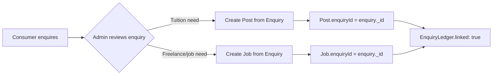

# Create a Job or Post from Enquiry

Consumer enquiries can be converted into actionable **Jobs** (freelance work) or **Posts** (tuition) directly from the admin panel. This maintains a traceable link between the original enquiry and the resulting listing.

## Overview



## Step-by-Step (Admin Panel)

### 1. Open the Enquiry

Navigate to **Admin → Enquiries** and open the enquiry you want to convert.

The enquiry shows:
- Consumer name and phone
- Query / requirement description
- Source (WhatsApp, call, website form, etc.)
- Current status (`new`, `in_progress`, `contacted`, etc.)

### 2. Update Enquiry Status

Before converting, update the status to `in_progress` to signal that admin action is underway:

```
PATCH /api/v1/enquiry/:enquiryId
{ "currentStatus": "in_progress", "lastActionNote": "Converting to tuition post" }
```

This also logs the status change in `EnqStatus` (the enquiry status history collection).

### 3a. Create a Post (Tuition)

Click **"Create Post from Enquiry"** in the admin panel. This pre-fills the post creation form with data from the enquiry and sets `enquiryId`.

**API call**:
```
POST /api/v1/posts
{
  "enquiryId": "6843f2a1b4e5c9d0e8f12345",   ← the enquiry's _id
  "guardianName": "Mrs. Sharma",
  "guardianPhone": "9876543210",
  "source": "WhatsApp",
  "students": [{
    "className": "Class 9",
    "board": "CBSE",
    "subjects": ["Mathematics", "Science"]
  }],
  "classType": "offline",
  "frequencyPerWeek": 3,
  "location": "Salt Lake, Kolkata",
  "monthlyBudget": 3000
}
```

### 3b. Create a Job (Freelance)

Click **"Create Job from Enquiry"** in the admin panel. This creates a freelance job post with `enquiryId` set.

**API call**:
```
POST /api/v1/jobs
{
  "enquiryId": "6843f2a1b4e5c9d0e8f12345",   ← the enquiry's _id
  "workType": "project",
  "title": "Frontend Developer for E-commerce Site",
  "clientName": "Raj Enterprises",
  "phoneNumber": "9876543210",
  "source": "Referral",
  "companyType": "company",
  "locationType": "remote",
  "location": "Remote",
  "timing": "Flexible",
  "gender": "all",
  "commissionBasis": "project_value",
  "academyCommissionPercentage": 10
}
```

### 4. Auto-Close Enquiry (Optional)

Once the post/job has been created and providers have been assigned, update the enquiry status to `resolved`:

```
PATCH /api/v1/enquiry/:enquiryId
{ "currentStatus": "resolved", "lastActionNote": "Post-1234 created and teacher assigned" }
```

## The enquiryId Link

Both `Post` and `Job` models have an `enquiryId` field:

```ts
// lib/models/Post.ts
enquiryId: { type: Schema.Types.ObjectId }

// lib/models/Job.ts
enquiryId: { type: Schema.Types.ObjectId, ref: "Enquiry" }
```

This enables:
- **Admin traceability**: See which enquiry spawned a post/job
- **Consumer follow-up**: Call the consumer using their original enquiry phone number
- **Analytics**: Track conversion rate from enquiry → post → assignment

## Enquiry Status Flow

```
new → in_progress → contacted → resolved
                 ↘               ↗
                  unreachable → closed
```

| Status | Meaning |
|---|---|
| `new` | Just submitted, no admin action yet |
| `in_progress` | Admin is actively handling |
| `contacted` | Admin or provider has contacted the consumer |
| `unreachable` | Consumer is not responding |
| `resolved` | Requirement fulfilled (post/job created + assigned) |
| `closed` | Closed without action (wrong enquiry, duplicate, etc.) |

Each status change is stored in the `EnqStatus` collection for a full audit trail.

## PostLedger and EnquiryLedger

When a post is created from an enquiry:
1. A `PostLedger` document is created (for the Tuitions sheet)
2. The `EnquiryLedger` is updated with `postId` to mark it as converted
3. Both sync to the Google Sheet automatically
