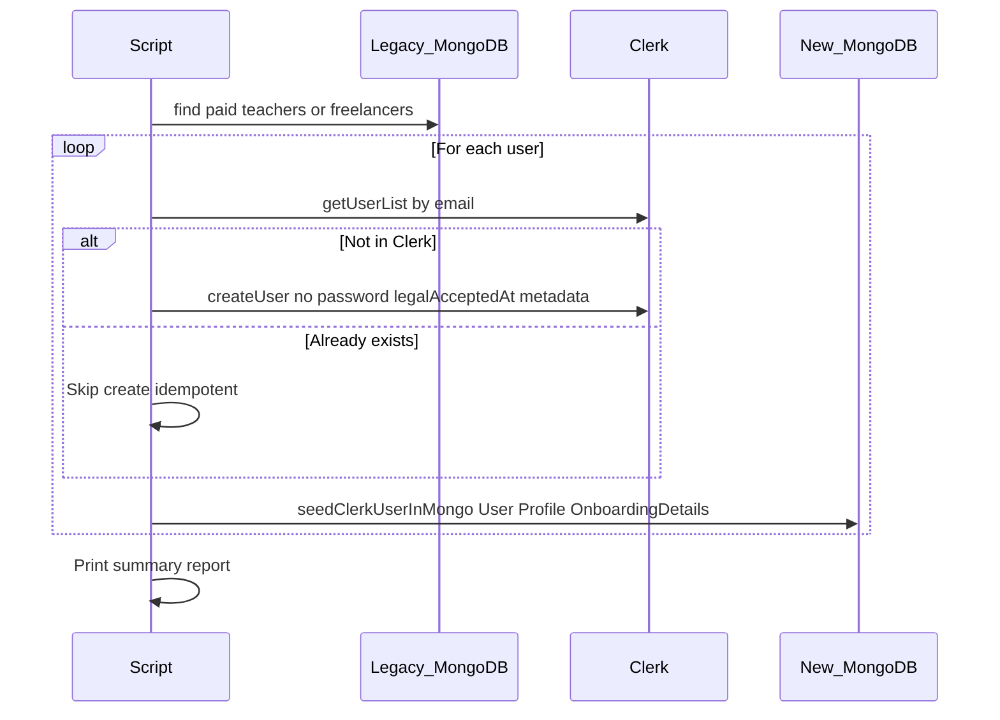

# Seed Teachers & Candidates

AOTF provides migration scripts to import **paid** teachers and freelance candidates from the **legacy production MongoDB** into **Clerk** and the **new app MongoDB**. The legacy cluster is read-only; scripts never modify it.

For a full production runbook, see [Migrate Legacy Users](/docs/how-to/migrate-legacy-users).

> **Critical**: Clerk's **development** instance supports a maximum of **100 users**. Use a **production** Clerk instance (`pk_live_` / `sk_live_`) for real migrations.

## Script Matrix

| Script | Source | Role in Clerk | Notes |
|---|---|---|---|
| `scripts/migrate-teachers-to-clerk.mjs` | Legacy `teachers` collection | `teacher` | **Recommended** for teachers |
| `scripts/migrate-freelancers-to-clerk.mjs` | Legacy `freelancers` collection | `teacher_candidate` | **Recommended** for candidates |
| `scripts/migrate-to-clerk.mjs` | Single `MONGODB_URI` | Mixed | **Deprecated** — no paid filter, no direct Mongo seed |
| `scripts/sync-clerk-users-to-mongodb.mjs` | Clerk user list | — | Backfill when users exist in Clerk but not `/admin/users` |
| `pnpm sync:clerk-users` | Clerk user list | — | TypeScript wrapper for the sync script |

## Data Source

Scripts read from the legacy database **`academy-of-tutorials-freelancers`** on `MONGODB_URI_LEGACY`:

- Collection `teachers` — filter `{ registrationFeeStatus: "paid" }`
- Collection `freelancers` — filter `{ registrationFeeStatus: "paid" }`

Required fields per record: `email`, `name`. Optional: `teacherId`, `termsAgreedAt`, `createdAt`.

Usernames are **derived from email** (letters only, lowercase, 4–32 chars) with numeric suffix retries on collision. There is no CSV/JSON import step.

## Required Environment Variables

```bash
MONGODB_URI_LEGACY=mongodb+srv://...   # Legacy cluster (read-only)
MONGODB_URI=mongodb+srv://...        # New app database
CLERK_SECRET_KEY=sk_live_...         # Target Clerk instance
```

Load these from `.env.local` at the repo root (scripts call `dotenv` automatically).

## How Migration Works



Each created Clerk user gets this `publicMetadata`:

```json
{
  "role": "teacher",
  "onboardingCompleted": false,
  "migratedFromLegacy": true,
  "registrationFeeStatus": "paid",
  "legacyPlan": "teacher",
  "legacyTeacherId": "AOT-XXXX"
}
```

Freelancers use `role: "teacher_candidate"` and `legacyPlan: "teacher_candidate"`.

**MongoDB write path**: Scripts call `seedClerkUserInMongo()` immediately after each Clerk user is created or found. The [`user.created` webhook](/docs/reference/api/webhooks) is a **backup** path if seeding fails or the user signs in before the script finishes.

Clerk users are created **without a password**. Migrated users sign in via [Google SSO](/docs/explanations/account-linking) (same Gmail auto-links) or set a password via Forgot Password.

## Running the Scripts

```bash
cd scripts

# Dry run (default) — prints what would be created, no writes
node migrate-teachers-to-clerk.mjs
node migrate-freelancers-to-clerk.mjs

# Live migration — creates Clerk users and seeds MongoDB
node migrate-teachers-to-clerk.mjs --live
node migrate-freelancers-to-clerk.mjs --live

# Backfill MongoDB from existing Clerk accounts
node sync-clerk-users-to-mongodb.mjs --live
# or from repo root:
pnpm sync:clerk-users -- --live
```

> Scripts use `.mjs` (ES Modules) and run with `node`, not `tsx`.

## Post-Migration Sync

Run the sync script when:

- Users appear in the Clerk dashboard but not on `/admin/users` (admin UI reads MongoDB, not Clerk directly)
- A prior migration created Clerk users but Mongo seeding failed partway through

The admin Users page also triggers sync on load via `GET /api/admin/app-users?sync=1` — see [Manage Users in Admin](/docs/how-to/admin-manage-users).

## Known Edge Cases

| Issue | Cause | Resolution |
|---|---|---|
| `legal_accepted_at` required | Prod Clerk has legal consent enabled | Scripts set `skipLegalChecks: true` and `legalAcceptedAt` from legacy `termsAgreedAt` |
| Username too long | Email local part exceeds Clerk limit | Create user manually with a shorter username (e.g. `aryabandyopadhyay`) |
| Invalid email | Bad legacy data (e.g. `abc@a.c`) | Skip or fix in legacy DB |
| Mongo duplicate key on onboarding | Orphan `OnboardingDetails` for same `userId` | Re-run sync script (upsert matches `clerkId` or `userId`) |
| DNS `querySrv ECONNREFUSED` | Local DNS cannot resolve Atlas SRV | Set `NODE_ENV=production` in `.env.local` (scripts use public DNS 1.1.1.1) |

Re-running migration scripts is **idempotent**: existing emails are skipped in Clerk and Mongo is re-seeded.

## Clerk 100-User Dev Limit

When the dev instance reaches 100 users, new sign-ups are blocked. Options:

| Option | When to use |
|---|---|
| Delete test users in Clerk dashboard | Local dev cleanup |
| Switch to production Clerk keys | Real user migration |
| Request limit increase | Contact Clerk support (not guaranteed for dev) |

## Other Seed Scripts

### Subjects & Sources

```bash
pnpm tsx scripts/seed-subjects-sources.ts
```

Populates `Subject` and `Source` collections for post/job forms. Idempotent.

### Calendar Events Backfill

```bash
pnpm tsx scripts/backfill-calendar-events.ts
```

Rebuilds `CalendarEvent` from existing applications, enquiries, feedback, and todos.
