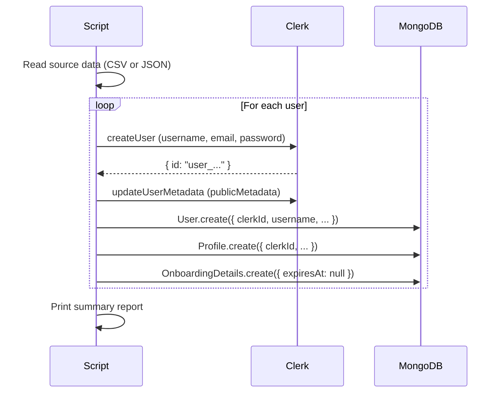

# Seed Teachers & Candidates

AOTF provides migration scripts to bulk-import existing teachers and candidates from a legacy system into Clerk + MongoDB. These scripts create Clerk accounts and corresponding `User` + `Profile` documents.

> **⚠ Critical**: Clerk's development instance has a hard limit of **100 users**. Plan your seeding carefully — once you hit 100, no new sign-ups work until you delete users or switch to a production instance.

## Available Scripts

| Script | Purpose |
|---|---|
| `scripts/migrate-teachers-to-clerk.mjs` | Imports teachers (tuition-only access) |
| `scripts/migrate-freelancers-to-clerk.mjs` | Imports freelance candidates |
| `scripts/migrate-to-clerk.mjs` | General-purpose migration script |

## How the Migration Works



The scripts set `publicMetadata.migratedFromLegacy: true` and `publicMetadata.registrationFeeStatus: "paid"` on each Clerk user. The Clerk webhook then:

1. Detects the `migratedFromLegacy: true` flag on `user.created`
2. Creates an `OnboardingDetails` stub with `expiresAt: null` (skips the 30-day TTL)
3. Preserves legacy plan and teacher ID in metadata

## Running a Seeding Script

```bash
# Set required env vars
export CLERK_SECRET_KEY=sk_test_...
export MONGODB_URI=mongodb+srv://...

# Run the teacher migration
node scripts/migrate-teachers-to-clerk.mjs

# Run the freelancer migration
node scripts/migrate-freelancers-to-clerk.mjs
```

> **Note**: These scripts use `.mjs` extension (ES Modules) and run with `node`, not `tsx`.

## Input Data Format

The scripts expect a data source (CSV or MongoDB export) with at minimum:

```json
{
  "name": "Full Name",
  "email": "teacher@example.com",
  "phone": "9876543210",
  "username": "teacher_username",
  "subjects": ["Math", "Physics"],
  "plan": "teacher"
}
```

Edit the script to match your actual data source format.

## Clerk 100-User Dev Mode Limit

### What Happens at 100 Users

When you reach 100 users in Clerk's development instance:
- New sign-ups return an error
- The Clerk dashboard shows a warning banner
- Existing users can still log in normally

### How to Check Current Count

In **Clerk Dashboard → Users**, the total count is shown in the header.

### Options When You Hit the Limit

| Option | When to Use |
|---|---|
| **Delete inactive users** | Dev/testing — clean up test accounts |
| **Switch to Production instance** | Ready for real users |
| **Request limit increase** | Contact Clerk support (not guaranteed for dev) |

### Deleting Test Users in Bulk

```bash
# The Clerk SDK allows bulk deletion — write a quick script:
# (example — adjust to your actual usernames)
node -e "
const { clerkClient } = require('@clerk/nextjs/server');
async function main() {
  const client = clerkClient();
  const { data } = await client.users.getUserList({ limit: 100 });
  const testUsers = data.filter(u => u.username?.startsWith('test_'));
  for (const u of testUsers) {
    await client.users.deleteUser(u.id);
    console.log('Deleted:', u.username);
  }
}
main();
"
```

## Subjects & Sources Seed Script

The `scripts/seed-subjects-sources.ts` script populates the `Subject` and `Source` collections used in the post/job creation forms:

```bash
pnpm tsx scripts/seed-subjects-sources.ts
```

This is a one-time operation and is idempotent (safe to re-run).

## Calendar Events Backfill

After migrating data, you may need to rebuild the `CalendarEvent` collection for all existing applications and enquiries:

```bash
pnpm tsx scripts/backfill-calendar-events.ts
```

This script reads all existing `Application`, `Enquiry`, `Feedback`, and `TodoEvent` documents and upserts corresponding `CalendarEvent` records.
