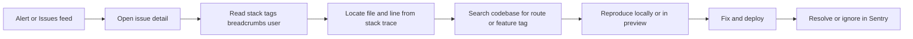

# Triage Sentry Errors

When something goes wrong in production, Sentry is the starting point. This guide walks through identifying the issue in the dashboard, locating the relevant code, fixing it, and confirming the fix landed.

For background on why Sentry is set up and what each dashboard surface shows, see [Monitoring with Sentry](/docs/explanations/monitoring-sentry).

## Overview



## Step 1 — Open Sentry Issues

1. Go to [aotf.sentry.io](https://aotf.sentry.io/) → project **`javascript-nextjs`**
2. Open **Issues**
3. Sort by **Last Seen** or **Events** (frequency)
4. Filter by environment **`production`** to exclude local dev noise

If you received an alert email or Slack notification, click through directly to the linked issue.

## Step 2 — Read the Issue Page

Before touching code, gather context from the issue detail view:

| Field | What to look for |
|---|---|
| **Stack trace** | Top frame is usually the throw site; click file:line to jump to source (requires uploaded source maps) |
| **Tags** | `route` (API path), `layer` (e.g. `instrumentation`, `webhook`), `feature` (client UI area) |
| **Extra** | Custom context passed to `reportError()` — phase, payload hints, etc. |
| **Breadcrumbs** | Sequence of events leading to the error (navigation, fetch, console) |
| **User** | Clerk user id if the error happened while someone was signed in |

Note the **first seen** and **last seen** timestamps — a spike after a deploy often points to a regression in that release.

## Step 3 — Map the Stack Trace to Code

### API route errors

If the tag or stack trace mentions a route like `GET /api/v1/admin/posts`:

1. Open the matching file under `app/api/` (App Router maps URL segments to directories)
2. Find the `catch` block that calls `handleApiError(error, "GET /api/v1/admin/posts")` or `reportError()`

### Client errors

If the stack trace points to a component under `components/` or `app/admin/`:

1. Open the file at the reported line
2. Look for `reportClientError(error, { feature: "..." })` in the surrounding `catch` block

### Framework / infrastructure errors

| Symptom | Likely file |
|---|---|
| Unhandled request error | Route handler or middleware — check `instrumentation.ts` `onRequestError` |
| MongoDB warm-up failure | `instrumentation.ts` — tags `layer: instrumentation` |
| Auth redirect failure | `proxy.ts` |
| Webhook processing | `app/api/v1/webhooks/clerk/route.ts` or `razorpay/route.ts` |

## Step 4 — Search the Codebase

When the stack trace is minified or unclear:

```bash
# Find where a route is reported
rg "reportError" app/api/ --glob "*.ts"

# Find client-side reporting for a feature
rg "reportClientError" app/admin/ components/

# Search for the error message text
rg "your error message" .
```

For API routes, trace the flow: route handler → service/lib call → the line that throws.

## Step 5 — Classify the Error

Decide whether this is a **bug** or **expected operational noise**:

| Classification | Action |
|---|---|
| **Bug** (unexpected 500, webhook crash, data corruption) | Fix the root cause |
| **Operational** (validation failure, duplicate entry, user cancelled payment) | Should have been filtered by `shouldReportToSentry()` — extend the filter in `lib/sentry-report.ts` if it is flooding Issues |
| **Transient** (Atlas cold start timeout, network blip) | Monitor frequency; add retry logic if recurring |

Do not mark operational noise as **Resolved** in Sentry without fixing the filter — it will reappear on the next occurrence.

## Step 6 — Reproduce, Fix, and Deploy

1. **Reproduce** locally (`pnpm dev`) or on a Vercel preview deployment
2. **Fix** the root cause — keep the change minimal and focused
3. **Deploy** to production via the normal git → Vercel pipeline
4. **Watch** the issue in Sentry — event count should drop to zero for that release
5. **Resolve** the issue in Sentry once confirmed fixed (or let auto-resolve on release if configured)

## Step 7 — Cron-Specific Triage

For failures in the **`manage-unpaid-users`** cron:

1. Sentry → **Crons** → monitor `manage-unpaid-users`
2. Check status: missed, failed, or timed out
3. Verify in Vercel:
   - Cron is configured in `vercel.json`
   - `CRON_SECRET` is set in environment variables
4. Open `app/api/v1/cron/manage-unpaid-users/route.ts` and review the failure path — partial failures call `reportError` with details about which users failed

## Troubleshooting — Nothing Appears in Sentry

| Symptom | Check |
|---|---|
| No events after deploy | `NEXT_PUBLIC_SENTRY_DSN` set in Vercel for Production environment |
| Events only in dev, not prod | Filter by environment; confirm production DSN is active |
| Client errors missing | Ad-blocker may block ingest — tunnel at `/monitoring` should handle this; verify `tunnelRoute` in `next.config.js` |
| Expected errors flooding Issues | Review `shouldReportToSentry()` filters in `lib/sentry-report.ts` |
| Stack traces show minified code | Set `SENTRY_AUTH_TOKEN`, `SENTRY_ORG`, and `SENTRY_PROJECT` in Vercel build env for source map upload |

## Related Docs

- [Monitoring with Sentry](/docs/explanations/monitoring-sentry) — philosophy, coverage, and configuration
- [Deploy to Vercel — Sentry checklist](/docs/how-to/deploy-vercel#sentry-post-deploy-checklist)
- [Environment Variables](/docs/reference/env-vars#sentry-monitoring)
