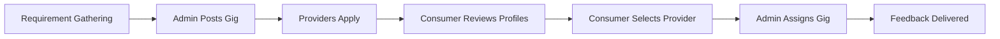

## What is AOTF?

**Academy of Tutorials & Freelancers (AOTF)** is a comprehensive platform that acts as an intermediary connecting **Providers** (Tutors and Freelancers) with **Consumers** (Students, Parents, and Clients).

The platform digitises and streamlines the gig-matching process for an educational and freelancing agency. It acts as a centralised hub where gig requirements are posted, applications are submitted, and profiles are reviewed — bridging the gap between demand and supply in the tutoring and freelancing markets.

---

## Core Business Workflow

AOTF supports a **semi-automated, admin-moderated** workflow to ensure quality and control:

1. **Requirement Gathering** — Gig requirements (tuitions or freelance projects) come to the agency/admins via enquiries or direct contact.
2. **Posting** — Admins post these requirements (Jobs/Tuitions) on the platform.
3. **Application** — Providers (Tutors/Freelancers) browse available gigs and apply directly through the platform.
4. **Review** — Consumers (Students/Parents/Clients) can view the detailed profiles of the providers who applied.
5. **Selection & Contact** — Consumers make a selection and communicate their choice to the admins.
6. **Admin Assignment** — Admins use the platform's backend to formally select the provider, manage assignment details, and generate invoices.
7. **Feedback Loop** — Providers receive transparent feedback indicating whether they were selected, including reasons if declined.

---

## User Personas & Roles

### Non-Admin Personas

| Persona | Description |
|---------|-------------|
| **Providers** (Tutors / Freelancers) | Users looking for work. They maintain rich profiles and apply to open job/tuition posts. |
| **Consumers** (Students / Parents / Clients) | Users with requirements. They review provider profiles and finalise selections in coordination with admins. |

### Admin Roles (RBAC)

The platform features a robust, 3-tier Role-Based Access Control system:

| Role | Key Capabilities |
|------|-----------------|
| **Super Admin** (`super_admin`) | Full system access, admin management, password resets, audit log viewing |
| **Sub-Superadmin** (`admin`) | Manage support admins, content management (posts, jobs), view audit logs |
| **Support** (`moderator`) | Handle customer enquiries, update statuses, manage feedback/calls |

> For a complete breakdown of permissions, see [Roles & Permissions](/docs/admin-system/roles-and-permissions).

---

## Key Platform Features

- **End-to-End Gig Management** — From posting to application, review, and feedback
- **Admin Data Entry & Assignment** — Specialised admin panel for finalising selections and tracking gig details
- **Feedback Mechanism** — Automated transparent feedback delivery to providers post-selection
- **Invoice Generation** — Auto-generated invoices with line items, tax, and partial payment tracking
- **Calendar Integration** — Mongoose write-through hooks for automatic calendar event synchronisation
- **Security & Auditing** — Automatic account lockouts, forced password resets, and comprehensive audit logging
- **Google Sheets Sync** — Enquiry ledger synced to Google Sheets for offline tracking
- **Scalable Architecture** — Serverless API routes with a document database, deployed on Vercel
