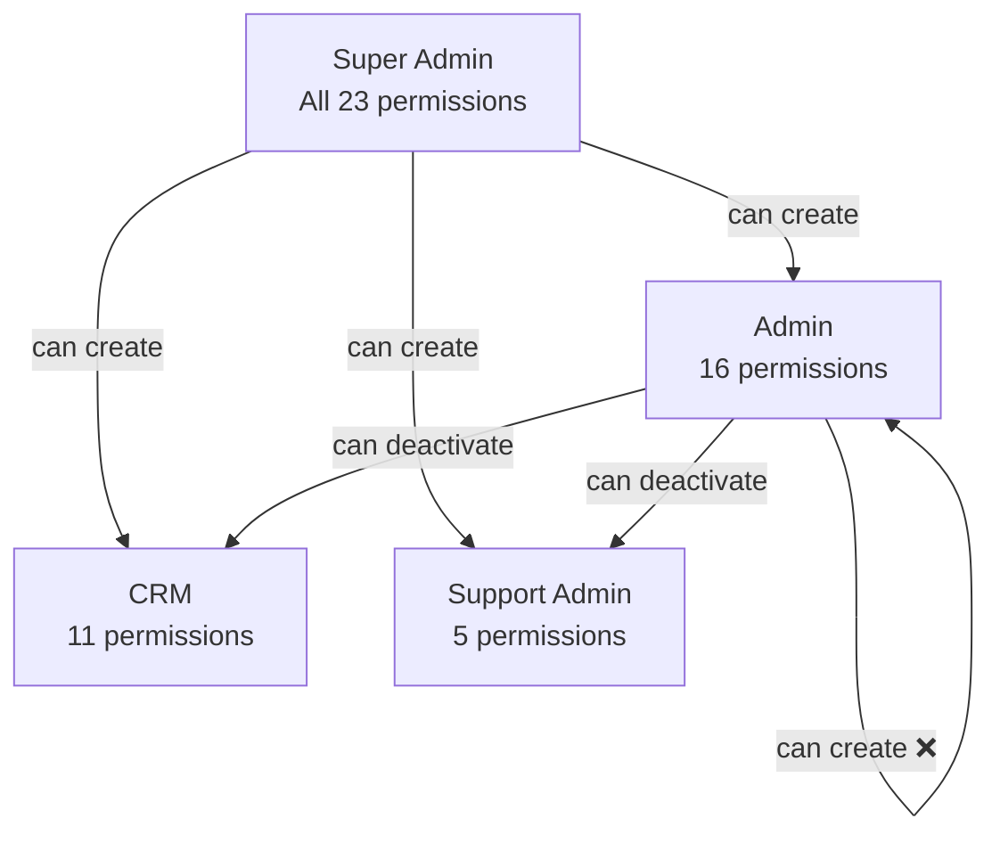
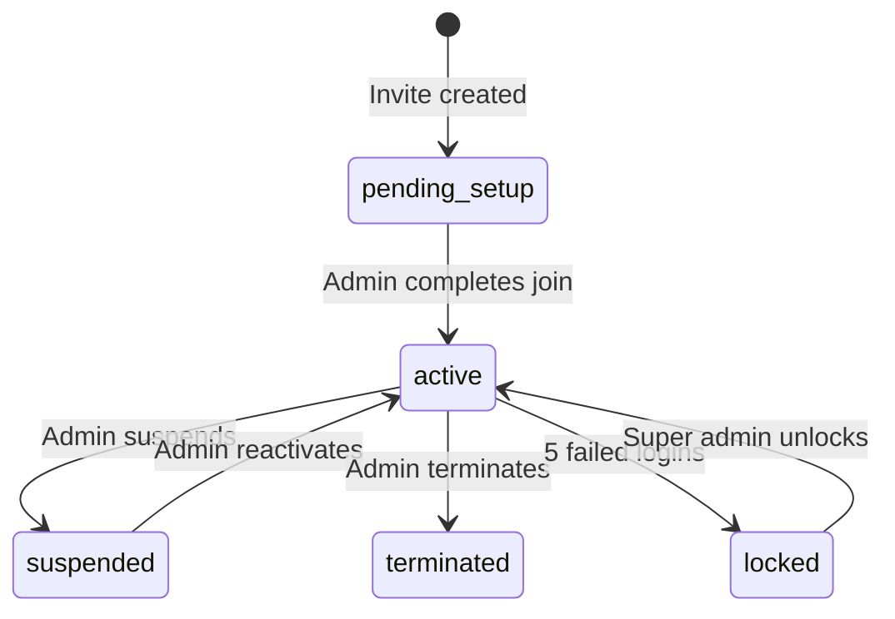
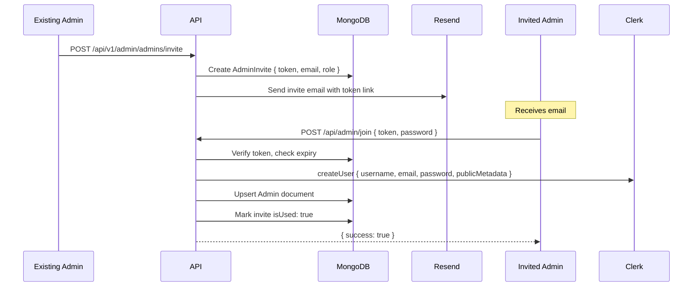

# Admin Hierarchy & Access Control

## Role Hierarchy

### Creation Rules

| Who Can Create | Created By |
|---|---|
| `super_admin` | Only another `super_admin` (or via `pnpm create:admin` script) |
| `admin` | Only `super_admin` |
| `support_admin` | `super_admin` or `admin` (with `canCreateAdmins`) |
| `crm` | `super_admin` or `admin` (with `canCreateAdmins`) |

> **Key restriction**: An admin can **never** create an account with equal or higher privileges than their own role.

### Management Rules

| Operation | Who Can Perform |
|---|---|
| Create admin invite | `canCreateAdmins` |
| Edit admin details | `canEditAdmins` |
| Deactivate admin | `canDeactivateAdmins` |
| Reset admin password | `canResetAdminPasswords` (super_admin only) |
| Terminate admin | `canTerminateAdmins` (super_admin only) |

## Account States

| State | `isActive` | `isLocked` | Description |
|---|---|---|---|
| `active` | `true` | `false` | Normal operation |
| `locked` | `true` | `true` | Auto-locked after 5 failed login attempts |
| `suspended` | `false` | `false` | Temporarily deactivated by another admin |
| `terminated` | `false` | — | Permanent removal (soft delete) |

### Account Lock Behavior

- After **5 failed login attempts**, `Admin.isLocked` is set to `true`
- All subsequent login attempts fail with `"Account locked"` error
- Only a `super_admin` can unlock via the admin panel
- Failed attempts are logged in `LoginAttempt` collection

## Invite-Based Onboarding

New admins cannot self-register. The flow is:

1. Super Admin / Admin with `canCreateAdmins` creates an invite in the admin panel
2. An email is sent to the new admin with a secure token link
3. New admin clicks the link → `POST /api/admin/join` with the token
4. Clerk account is created, `Admin` document is upserted, invite is marked `isUsed: true`
5. Token expires after **7 days** (TTL index on `AdminInvite.expiresAt`)

## Super Admin Protection

The platform enforces these safety rules:

1. **Cannot deactivate own account** — prevents accidental lockout
2. **Cannot reduce own permissions** — super admins cannot demote themselves
3. **At least one super admin must always be active** — if the last super admin tries to deactivate, the operation is rejected
4. **Terminate requires confirmation** — termination is a two-step action requiring explicit confirmation

## Clerk vs MongoDB Authority

| Concern | Authority |
|---|---|
| **Is the JWT valid?** | Clerk |
| **Is this user an admin?** | Clerk `publicMetadata.isAdmin` (fast check) |
| **What are the admin's permissions?** | **MongoDB `Admin.permissions`** (source of truth) |
| **Is the account active?** | **MongoDB `Admin.isActive`** (source of truth) |
| **Is the account locked?** | **MongoDB `Admin.isLocked`** (source of truth) |

The Clerk JWT contains a **cached copy** of permissions for performance. On every admin request, the DB is consulted for the authoritative permission state.
