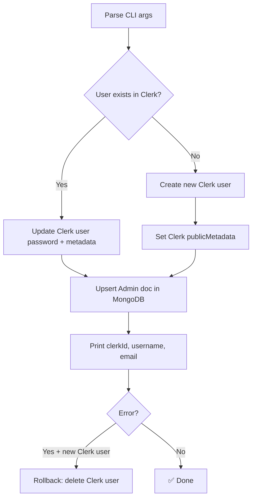

# Creating Your First Admin

Admin accounts are **not self-registerable**. They are created via the `create-admin.ts` script, which provisions the account in both Clerk and MongoDB in a single atomic operation.

## Prerequisites

- `CLERK_SECRET_KEY` set in `.env.local`
- `MONGODB_URI` set in `.env.local`
- The dev server does **not** need to be running

## Basic Usage

```bash
pnpm create:admin -- --username admin1 --password "StrongPass123!" --email admin@aotf.in
```

### All Options

```bash
pnpm create:admin -- \
  --username <username>   # Required: lowercase, alphanumeric
  --password <password>   # Required: must meet Clerk's strength policy
  --email    <email>      # Optional: defaults to <username>@<ADMIN_EMAIL_DOMAIN>
  --name     "Full Name"  # Optional: defaults to formatted username
  --role     <role>       # Optional: defaults to super_admin
```

### Positional shorthand

```bash
# username and password as positional args (no flags)
pnpm create:admin -- admin1 "StrongPass123!"
```

## Admin Roles

The `--role` flag accepts one of four values:

| Role | Flag Value | Description |
|---|---|---|
| Super Admin | `super_admin` | Full platform access (default) |
| Admin | `admin` | Content + enquiry management, limited admin mgmt |
| Support Admin | `support_admin` | Enquiry and feedback only |
| CRM | `crm` | Content creation + enquiries, no financial access |

```bash
# Create a support admin
pnpm create:admin -- --username support1 --password "Pass123!" --role support_admin

# Create a CRM admin
pnpm create:admin -- --username crm1 --password "Pass123!" --role crm
```

## What the Script Does



1. **Looks up existing Clerk user** by username then email (idempotent — safe to re-run)
2. **Creates or updates Clerk user** with the given credentials
3. **Sets `publicMetadata`** on the Clerk user with role, permissions, and `isAdmin: true`
4. **Upserts the `Admin` document** in MongoDB using `findOneAndUpdate` with `upsert: true`
5. **Rollback on failure**: if a new Clerk user was created but MongoDB write failed, the Clerk user is deleted to keep both stores consistent

## Clerk `publicMetadata` Structure

After running the script, the Clerk user's `publicMetadata` will contain:

```json
{
  "role": "super_admin",
  "isAdmin": true,
  "aotfRole": "SUPER_ADMIN",
  "requirePasswordChange": false,
  "permissions": {
    "canManageUsers": true,
    "canBlockUsers": true,
    "canManagePosts": true,
    "canManageJobs": true,
    "canCreateTuitionPosts": true,
    "canCreateJobPosts": true,
    "canEditPosts": true,
    "canDeletePosts": true,
    "canHandleEnquiries": true,
    "canHandleFeedbacks": true,
    "canUpdateEnquiryStatus": true,
    "canCallApplicants": true,
    "canProcessRefunds": true,
    "canViewPayments": true,
    "canViewAnalytics": true,
    "canExportData": true,
    "canManageAdmins": true,
    "canCreateAdmins": true,
    "canEditAdmins": true,
    "canDeactivateAdmins": true,
    "canResetAdminPasswords": true,
    "canTerminateAdmins": true,
    "canViewAuditLogs": true
  }
}
```

This metadata is read by `proxy.ts` on every request to gate admin routes without a DB call.

## Email Handling

If `--email` ends with `.local` (e.g., `admin@aotf.local`), the script auto-generates a real email address using the `ADMIN_EMAIL_DOMAIN` env var:

```bash
ADMIN_EMAIL_DOMAIN=aotf.in
# admin@aotf.local → becomes → admin@aotf.in in Clerk
```

This lets you pass a `.local` sentinel for dev without having to use a real inbox.

## MongoDB Admin Document

After creation, you can verify the admin in MongoDB:

```js
db.admins.findOne({ username: "admin1" })
// Returns:
{
  _id: ObjectId("..."),
  clerkId: "user_...",
  username: "admin1",
  email: "admin1@aotf.in",
  name: "Admin1",
  role: "super_admin",
  permissions: { canManageUsers: true, ... },
  isActive: true,
  isLocked: false,
  requirePasswordChange: false,
  createdBy: null,
  createdAt: ISODate("..."),
  updatedAt: ISODate("...")
}
```

## Security Notes

- The script uses `skipPasswordChecks: false` — Clerk's password strength policy is **enforced**
- Admin accounts require password change on first login if `requirePasswordChange: true` is set
- After 5 failed login attempts, the admin account is **locked** (set by the login API route)
- Locked accounts must be unlocked by a Super Admin from the admin panel
