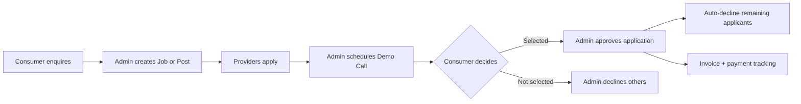

# What is AOTF?

**AOTF (Academy of Tutors & Freelancers)** is a privately-operated intermediary platform built and managed by **Soumyadip Ghosh**. It acts as a centralised hub connecting tutors and freelancers (Providers) with students, parents, and clients (Consumers) — all moderated by an internal admin team.

## The Problem It Solves

Traditional tutor/freelancer matching relies on phone calls, WhatsApp groups, and manual record-keeping. AOTF replaces this with:

- A structured application pipeline
- Verified provider profiles
- Admin-controlled matching
- Automated feedback delivery
- Digital invoicing and payment tracking

## Core Business Workflow

### Step by Step

1. **Enquiry** — A consumer (parent/student/client) contacts AOTF via the enquiry form or phone.
2. **Posting** — An admin creates a **Job** (freelance/project work) or **Post** (tuition) based on the requirement.
3. **Application** — Providers browse open posts and apply through the platform.
4. **Demo Call (DC)** — An admin schedules a demo session for shortlisted providers.
5. **Guardian Confirmation (GC)** — The consumer confirms they want to proceed after the demo.
6. **Approval** — Admin approves one application; all other active applications for that post are **auto-declined**.
7. **Feedback** — Declined providers receive a feedback reason through the platform.
8. **Invoice** — Admin generates an invoice for the consumer; payment is tracked in the PostLedger.

## User Personas

### Providers (Non-Admin)

| Type | Description |
|---|---|
| **Teacher** | Applies to tuition posts (`hasTuitionAccess: true`) |
| **Teacher Candidate** | Applies to both tuition and freelance/job posts (`hasCandidateAccess: true`) |

Providers register, pay a one-time registration fee via Razorpay, complete onboarding, and then gain access to the platform.

### Consumers

Consumers are **not platform users**. They interact with AOTF off-platform (calls, messages) and through the public-facing application pages (`/u/[username]` profile pages). The admin team handles the rest.

### Admin Roles

There are **4 admin roles** with progressively scoped permissions:

| Role | Code | Level |
|---|---|---|
| Super Admin | `super_admin` | Full access — all permissions |
| Admin | `admin` | Content + enquiry + limited admin management |
| Support Admin | `support_admin` | Enquiry-only, no content or financial access |
| CRM | `crm` | Content creation + enquiries, no financial/admin mgmt |

See [Admin Hierarchy](/docs/reference/admin/hierarchy) for the full permission matrix.

## Platform URLs

| Environment | URL |
|---|---|
| Production | `https://aotf.in` |
| Docs | `https://docs.aotf.in` → redirects to `https://aotf.in/docs` |
| Dev | `http://localhost:3000` |

## Key Numbers (Free Tier Constraints)

| Service | Tier | Limit |
|---|---|---|
| Vercel | Free (Hobby) | 100 GB bandwidth/month, 10s serverless function timeout |
| MongoDB Atlas | M0 (Free) | 512 MB storage, shared cluster, auto-pauses after 60 min inactivity |
| Clerk | Development | 100 users max in dev mode |
