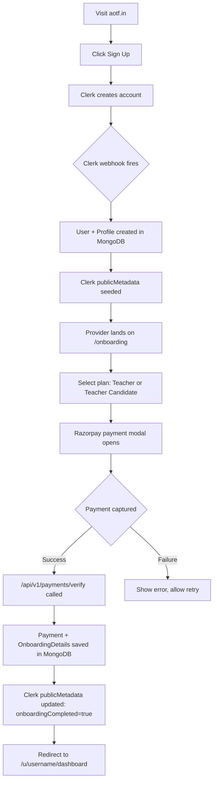
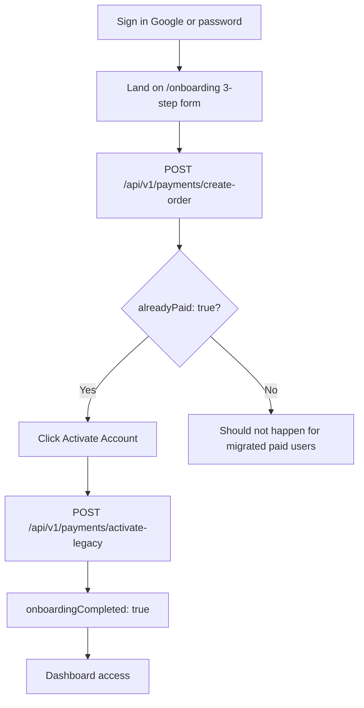

# Provider Onboarding Walkthrough

This tutorial traces the complete journey a new provider (teacher or candidate) takes from first visit to gaining full platform access.

## Overview

## Step 1: Sign Up

Providers visit `https://aotf.in/sign-up` and register with:
- Username (permanent, cannot be changed after creation)
- Email
- Password

Clerk handles form validation and account creation. Upon successful sign-up, Clerk fires a `user.created` webhook.

## Step 2: Clerk Webhook → MongoDB

The webhook handler at `/api/v1/webhooks/clerk` receives the `user.created` event and:

1. Creates a `User` document with `onboardingCompleted: false`
2. Creates a `Profile` document with basic info from Clerk
3. Updates Clerk `publicMetadata` with `{ role: "teacher", onboardingCompleted: false }`

> **Idempotency**: The webhook uses the `WebhookEvent` collection as a deduplication guard. Duplicate webhook deliveries are silently ignored.

## Step 3: Onboarding Gate

`proxy.ts` checks `sessionClaims.publicMetadata.onboardingCompleted` on every request. Since it's `false`, the provider is redirected to `/onboarding`.

**Fast path**: JWT claim is checked first (no DB call).  
**Slow path**: If the claim is missing or stale, the DB is queried as the source of truth.

## Step 4: Plan Selection & Payment

On `/onboarding`, providers complete a **3-step stepper**: personal/professional details → plan selection → payment or activation.

| Plan | Code | Registration fee |
|---|---|---|
| Teacher | `teacher` | ₹49 (4900 paise) |
| Teacher Candidate | `teacher_candidate` | ₹99 (9900 paise) |

Clicking **Pay** calls `POST /api/v1/payments/create-order`, which creates a Razorpay order (unless the user is a migrated legacy payer — see [Legacy Migrated Users](#legacy-migrated-users)).

### Razorpay Payment

**Rate**: 2% of the transaction amount + 18% GST on that 2% = **2.36% effective per transaction**

The Razorpay modal opens in the browser. On successful payment:

1. `POST /api/v1/payments/verify` is called with the payment signature
2. The server verifies the Razorpay HMAC signature
3. A `Payment` document is created in MongoDB
4. An `OnboardingDetails` document is created/updated with `expiresAt: null` (no auto-deletion)
5. The `User` document is updated: `onboardingCompleted: true`
6. Clerk `publicMetadata` is updated: `{ onboardingCompleted: true, plan: "teacher" }`

## Step 5: Dashboard Access

On next navigation (or after the JWT refreshes), `proxy.ts` reads `onboardingCompleted: true` from the JWT and allows the request through.

The provider is redirected to `/u/[username]/dashboard`.

## Data Created During Onboarding

| Collection | Document | Key Fields |
|---|---|---|
| `users` | `User` | `clerkId`, `username`, `role`, `plan`, `onboardingCompleted: true` |
| `profiles` | `Profile` | `clerkId`, `username`, `displayName`, `avatarUrl` |
| `onboarding_details` | `OnboardingDetails` | `clerkId`, `plan`, `status: "complete"`, `expiresAt: null` |
| `payments` | `Payment` | `razorpayPaymentId`, `razorpayOrderId`, `amount`, `status: "captured"` |

## Legacy Migrated Users

Users migrated from the previous system have `migratedFromLegacy: true` and `registrationFeeStatus: "paid"` in Clerk `publicMetadata`. They sign in with **Google** (same Gmail) or set a password — see [Account Linking](/docs/explanations/account-linking).

During migration or webhook seeding:

1. `OnboardingDetails` stub created with `expiresAt: null` (no auto-deletion timer for paid legacy users)
2. Legacy plan and teacher ID preserved in Clerk metadata
3. Razorpay is skipped — `create-order` returns `{ alreadyPaid: true }`

These users complete onboarding by clicking **Activate Account**, which calls `POST /api/v1/payments/activate-legacy` (zero-amount `legacy_migration` payment record).

## Profile Completion

After gaining access, providers can enrich their profile at `/u/[username]/profile`:

- Display name, bio (max 300 chars)
- Phone, WhatsApp, address
- Subjects, teaching experience, job experience
- Qualification, board preference, gender
- Social links (LinkedIn, Twitter, GitHub)
- Avatar (uploaded to Cloudinary)

A complete profile increases the chance of being selected by consumers.
